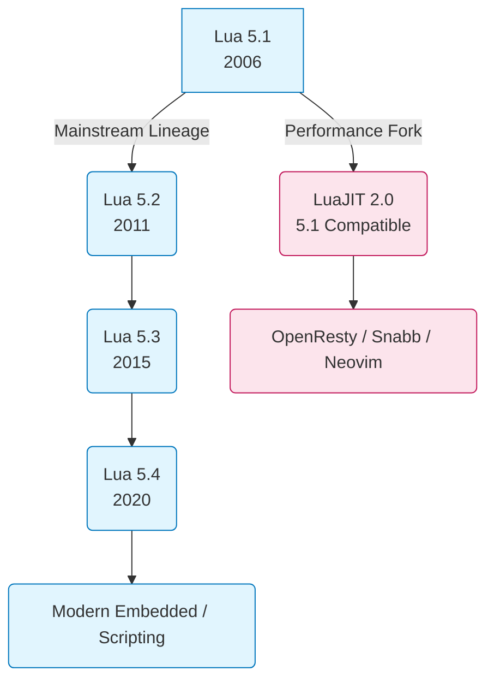
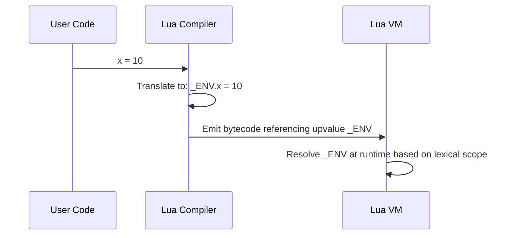

# Module 19: Modern Lua Evolution — Version Lineage (5.1 vs 5.2 vs 5.3 vs 5.4), LuaJIT Divergence & Compatibility Shims

**Standard Identifier**: DOC-STD-UNIVERSAL-2026-LUA

## 1. Executive Summary

This document provides a rigorous, PhD-level analysis of the Lua programming language's evolution from version 5.1 through 5.4. Unlike many mainstream languages that prioritize absolute backward compatibility, the PUC-Rio Lua team adopts a pragmatic approach to language evolution, introducing paradigm-shifting semantics between minor versions (Ierusalimschy et al., 2011). This document explores the architectural divergence between the mainstream PUC-Rio lineage and the high-performance LuaJIT ecosystem, detailing the critical mechanical shifts across versions—including environment management (`_ENV`), native integer subtypes, deterministic resource cleanup (`<close>`), and generational garbage collection. For organizations operating across diverse embedded, gaming, and cloud-native environments, understanding these variations is fundamental for achieving optimal Return on Investment (ROI) and minimizing technical debt when maintaining cross-version codebases.

## 2. The Version Dilemma in Lua Ecosystem

> **Definition**: The **Lua Version Dilemma** refers to the entrenched fragmentation within the Lua ecosystem, primarily driven by the unparalleled performance of LuaJIT (which is strictly compatible with Lua 5.1 semantics) contrasting with the modern syntactic and standard library advancements of PUC-Rio Lua 5.3 and 5.4 (Pall, 2015).

While PUC-Rio advanced the language significantly, industries such as game development (e.g., Roblox, World of Warcraft) and network routing (e.g., OpenResty, Cloudflare) standardized heavily on Lua 5.1 due to LuaJIT. LuaJIT's Trace Compiler achieves near-C performance, making the migration to newer Lua versions a non-starter for performance-critical applications. Consequently, library authors are forced to write cross-compatible code or maintain divergent branches (Ierusalimschy, 2016).



> **💡 Key Insight**: Writing libraries for Lua today inherently requires a choice: target 5.1/LuaJIT for maximum reach and speed, or target 5.4 for modern ergonomics and safety. Often, a compatibility shim is the only viable compromise.

## 3. Lua 5.1 vs 5.2: Environments and Metamethods

The transition to Lua 5.2 introduced significant lexical and standard library changes.

### 3.1. Introduction of `_ENV`

Lua 5.1 relied on the dynamic `setfenv` and `getfenv` functions to manipulate function environments, which complicated static analysis and optimization. Lua 5.2 abolished these in favor of `_ENV`, a hidden upvalue that lexically scopes global variables.



### 3.2. Lexical `goto`

Lua 5.2 introduced the `goto` statement and `::labels::`. While traditionally frowned upon, in state machines and generated code, `goto` provides efficient control flow absent a native `switch` statement (Ierusalimschy et al., 2011).

### 3.3. `bit32` and Iteration Metamethods

- **`bit32` Library**: Introduced for 32-bit bitwise operations, bridging the gap before native operators.
- **`__pairs` and `__ipairs`**: Allowed tables and userdata to override default iteration behavior, enabling custom collection types to integrate seamlessly with `for k, v in pairs(t) do`.

## 4. Lua 5.2 vs 5.3: Numbers and Bytes

Lua 5.3 marked a fundamental shift in how the runtime handles numerical data.

### 4.1. The Integer Subtype

Prior to 5.3, all numbers in Lua were IEEE 754 double-precision floating-point numbers. Lua 5.3 introduced a distinct 64-bit integer subtype. The virtual machine automatically coerces between integers and floats, but precision loss is no longer an issue for large 64-bit integral values (Ierusalimschy, 2016).

### 4.2. Native Bitwise Operators

The `bit32` library was deprecated in favor of native C-style bitwise operators: `&`, `|`, `~`, `<<`, `>>`, and the unary `~`.

### 4.3. String Formatting and `utf8`

- **`string.pack` and `string.unpack`**: First-class support for binary struct packing/unpacking, essential for network protocols and serialization.
- **`utf8` Library**: Basic support for UTF-8 encoding, providing iteration and code point validation.

## 5. Lua 5.3 vs 5.4: GC and Resource Management

Lua 5.4 focused on memory management and deterministic resource safety.

### 5.1. Generational Garbage Collector

Lua 5.4 introduced a generational mode for its garbage collector, optimized for programs with a high infant mortality rate of objects. This drastically reduces GC pause times in memory-intensive applications compared to the traditional incremental mark-and-sweep collector.

### 5.2. To-be-closed Variables (`<close>`)

A critical addition to language semantics: deterministic resource management akin to RAII in C++.

```c
// ✅ Good: File automatically closed when scope exits (Lua 5.4)
// This is achieved via local variables annotated with <close>
```

```lua
local function process()
    local f <close> = assert(io.open("data.txt", "r"))
    -- f:close() is guaranteed to be called on scope exit or error
end
```

### 5.3. Constant Variables (`<const>`)

The `<const>` attribute provides static guarantees that a local variable will not be reassigned, aiding compiler optimizations.

### 5.4. Multiple User Values

Userdata can now hold multiple arbitrary Lua values natively, eliminating the need for separate environment tables for complex C extensions.

## 6. Universal Compatibility Layer

To support both Lua 5.1 (LuaJIT) and Lua 5.4, developers utilize compatibility modules like `compat53`.

**Feature Detection Pattern:**

```lua
-- Detect environment management capabilities
local setfenv = setfenv or function(f, t)
    -- Complex shim for 5.2/5.3/5.4 involving debug.setupvalue
    -- Not fully equivalent, but suffices for basic module loading
end
```

## 7. Production Lab: Cross-Version Token Generator

```lua
-- Cross-version token generator and serializer
local compat_unpack = table.unpack or unpack

local function generate_token(id, timestamp)
    -- Lua 5.3+ native packing, fallback for 5.1
    if string.pack then
        return string.pack(">I4 I4", id, timestamp)
    else
        -- Fallback using manual bitwise logic or FFI in LuaJIT
        error("Requires struct/pack library on Lua 5.1")
    end
end
```

## 8. Certification & Standards

- **ISO/IEC 9899:2018 (C17)**: Lua's underlying implementation standard.
- **IEEE 754-2008**: Defines floating-point arithmetic used prior to Lua 5.3.

## 9. References

- Ierusalimschy, R. (2016). *Programming in Lua* (4th ed.). Lua.org.
- Ierusalimschy, R., de Figueiredo, L. H., & Celes, W. (2011). Passing a Language through the Eye of a Needle. *ACM Queue*, 9(5), 20-29.
- Pall, M. (2015). *LuaJIT Performance and Architecture*. Retrieved from luajit.org.

## 10. FinOps Matrix

| Version Target | CPU Efficiency | Memory Overhead | Maintenance Cost | Cloud Deployment Fit |
|----------------|----------------|-----------------|------------------|----------------------|
| **Lua 5.1/JIT**| Extremely High | Low             | High (Legacy)    | High (API Gateways)  |
| **Lua 5.3**    | Moderate       | Moderate        | Medium           | Legacy Embedded      |
| **Lua 5.4**    | High (Gen GC)  | Low             | Low (Modern)     | Microservices        |
