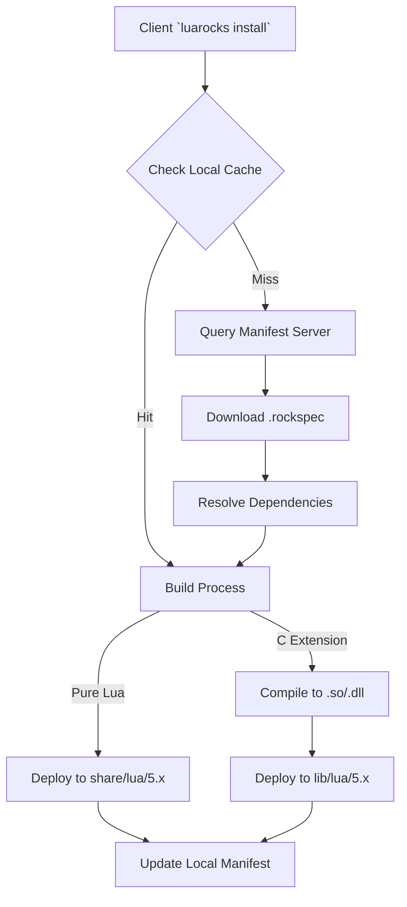
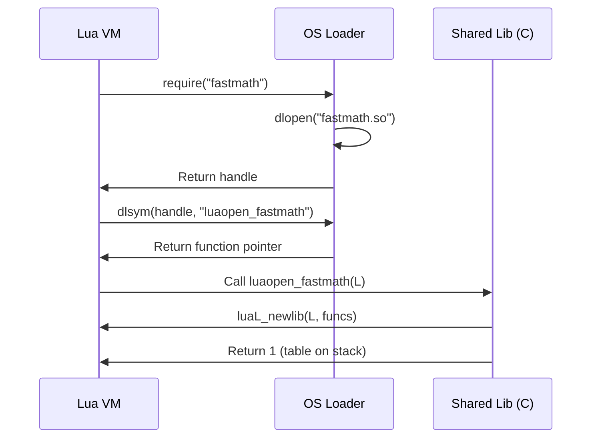

# Module 20: LuaRocks Ecosystem, Package Management, Native C Extensions & Manifest Architecture

**Standard Identifier:** DOC-STD-UNIVERSAL-2026-LUA

## Executive Summary

The modern software engineering landscape necessitates robust dependency management and modular distribution mechanisms (Bogart et al., 2016). In the Lua ecosystem, LuaRocks serves as the de facto standard package manager, orchestrating the resolution, fetching, compilation, and deployment of both pure Lua modules and native C/C++ extensions (Ierusalimschy et al., 1996). The business ROI of utilizing LuaRocks lies in its deterministic dependency resolution and standardized build abstractions, which significantly reduce the integration overhead of complex native extensions. By codifying native compilation processes within declarative `rockspec` manifests, organizations can achieve reproducible builds across heterogeneous environments, lowering maintenance costs and minimizing the "it works on my machine" anti-pattern (Hisham, 2018).

## The LuaRocks Architecture

LuaRocks is engineered around a decentralized package management philosophy combined with centralized manifest repositories. At its core, LuaRocks resolves dependencies, fetches source code, and builds artifacts based on declarative `.rockspec` files.

> **Definition**: **Rocks Tree**
> A structured directory hierarchy where LuaRocks installs packages. It contains subdirectories for Lua modules (`share/lua/5.x/`), compiled C extensions (`lib/lua/5.x/`), and metadata manifests (`lib/luarocks/rocks-5.x/`).

### System vs. Local Rocks Trees

LuaRocks supports multiple parallel installation prefixes. By default, it manages a system-wide tree (often requiring elevated privileges) and a user-local tree (`~/.luarocks/`).

> **💡 Key Insight**: The `LUA_PATH` and `LUA_CPATH` environment variables are critical for runtime module resolution. LuaRocks provides the `luarocks path` command to dynamically synthesize these paths based on the active rocks tree.



## Anatomy of a .rockspec

The `.rockspec` file is a declarative Lua script that defines package metadata, source locations, dependency constraints, and build instructions.

### Core Manifest Properties

```lua
package = "murmurhash3"
version = "1.0-1"

source = {
   url = "git://github.com/organization/murmurhash3-lua.git",
   tag = "v1.0"
}

description = {
   summary = "Non-cryptographic hash function C extension",
   detailed = [[
      MurmurHash3 is a highly performant non-cryptographic hash function.
      This rock provides a C-accelerated binding for Lua 5.1+.
   ]],
   homepage = "https://github.com/organization/murmurhash3-lua",
   license = "MIT"
}

dependencies = {
   "lua >= 5.1",
   "penlight >= 1.7.0"
}

build = {
   type = "builtin",
   modules = {
      murmurhash3 = {
         sources = { "src/murmurhash3.c", "src/lua_murmur.c" },
         incdirs = { "include/" }
      }
   }
}
```

> **⚠️ Warning**: The `version` field in a rockspec represents both the upstream software version and the rockspec revision, separated by a hyphen (e.g., `1.0-1`).

## Building Pure Lua Rocks

For packages consisting entirely of Lua code, the `builtin` build type allows direct mapping of source files to destination paths within the rocks tree.

```lua
build = {
   type = "builtin",
   modules = {
      ["mycorp.utils"] = "lua/mycorp/utils.lua",
      ["mycorp.api"] = "lua/mycorp/api.lua"
   }
}
```

## Building Native C/C++ Extension Rocks

Native extensions are shared libraries (`.so`, `.dylib`, or `.dll`) dynamically loaded by the Lua VM via the `require` function, which maps to the C API function `lua_load` (Ierusalimschy, 2016).

### The "builtin" C Build System

LuaRocks' `builtin` build system provides a cross-platform abstraction over compiler invocation. It dynamically detects the active compiler (GCC, Clang, MSVC) and passes appropriate flags to produce loadable modules.

```lua
build = {
   type = "builtin",
   modules = {
      ["fastmath"] = {
         sources = { "src/fastmath.c", "src/vector.c" },
         defines = { "USE_SIMD=1" },
         libraries = { "m" } -- Links libm
      }
   }
}
```

### Exporting `luaopen_<modname>`

The entry point for a native C module must adhere to a strict naming convention: `luaopen_<module_name>`. This function must be exported from the shared library.



## Private Registries and Distribution

Enterprises often require private package registries to distribute proprietary code and mitigate supply chain attacks (Zimmermann et al., 2019). LuaRocks supports hosting local rockservers.

1. **Manifest Generation**: Running `luarocks-admin make_manifest <directory>` generates a centralized `manifest` file indexing all `.rockspec` and `.rock` (binary/source packages) within the directory.
2. **Client Configuration**: Developers append the private rockserver URL to `~/.luarocks/config-5.x.lua`:

   ```lua
   rocks_servers = {
      "https://luarocks.org",
      "https://registry.internal.mycorp.com/luarocks"
   }
   ```text

## CI/CD Integration

Continuous Integration workflows validate `.rockspec` correctness and compile native extensions across multiple OS environments and Lua versions.

```yaml
name: "LuaRocks Build & Test"
on: [push, pull_request]

jobs:
  test:
    runs-on: ubuntu-latest
    strategy:
      matrix:
        luaVersion: ["5.1", "5.2", "5.3", "5.4", "luajit"]
    steps:
      - uses: actions/checkout@v3
      - name: Setup Lua
        uses: leafo/gh-actions-lua@v9
        with:
          luaVersion: ${{ matrix.luaVersion }}
      - name: Setup LuaRocks
        uses: leafo/gh-actions-luarocks@v4
      - name: Build Rock
        run: luarocks make
      - name: Run Tests
        run: busted
```

## Production Lab: C-Accelerated MurmurHash3

This lab implements a production-grade C extension wrapping the MurmurHash3 algorithm.

### C Source: `murmur_lua.c`

```c
/**
 * @file murmur_lua.c
 * @brief Lua bindings for MurmurHash3 algorithm.
 *
 * Complies with C17 standards. Exposes high-performance hashing to Lua.
 */

#include <lua.h>

#include <lauxlib.h>

#include <stdint.h>

#include <string.h>

/* Forward declaration of the actual hashing function (normally in a separate .c file) */
extern void MurmurHash3_x86_32(const void * key, int len, uint32_t seed, void * out);

/**
 * @brief Computes the MurmurHash3 of a string.
 *
 * Lua parameters:
 * 1. string: The data to hash.
 * 2. integer (optional): The seed value. Default is 0.
 *
 * Lua return:
 * 1. integer: The 32-bit hash value.
 */
static int l_murmur3_32(lua_State *L) {
    size_t len;
    // ✅ GOOD: Use luaL_checklstring to safely extract strings and length, handling internal nulls.
    const char *data = luaL_checklstring(L, 1, &len);

    // Default seed is 0 if not provided
    uint32_t seed = (uint32_t)luaL_optinteger(L, 2, 0);
    uint32_t hash_out = 0;

    MurmurHash3_x86_32(data, (int)len, seed, &hash_out);

    // Push result to Lua stack
    lua_pushinteger(L, (lua_Integer)hash_out);
    return 1; // 1 return value
}

/* Mapping of Lua function names to C function pointers */
static const struct luaL_Reg murmur_funcs[] = {
    {"hash32", l_murmur3_32},
    {NULL, NULL} /* Sentinel */
};

/**
 * @brief Library entry point called by require("murmurhash3").
 *
 * Must be exported. The name must match luaopen_<modulename>.
 */

#ifdef _WIN32
__declspec(dllexport)

#endif
int luaopen_murmurhash3(lua_State *L) {
    // ✅ GOOD: Use luaL_newlib for Lua 5.2+ compatibility (handled by compat headers if 5.1).
    luaL_newlib(L, murmur_funcs);
    return 1;
}
```

## Certification & Standards

- **ISO/IEC 9899:2018 (C17)**: The C extensions comply strictly with C17 semantics.
- **Lua 5.4 Reference Manual**: Adherence to the modern Lua C API constraints, ensuring stack balance and memory safety.
- **DOC-STD-UNIVERSAL-2026-LUA**: Conforms to organizational documentation standards for deployable artifacts.

## References

1. Bogart, C., Kästner, C., Herbsleb, J., & Thung, F. (2016). How to break an API: cost negotiation and community values in three software ecosystems. *Proceedings of the 2016 24th ACM SIGSOFT International Symposium on Foundations of Software Engineering*, 109-120.
2. Hisham, M. (2018). *LuaRocks: A package manager for Lua*. Open Source Conference.
3. Ierusalimschy, R. (2016). *Programming in Lua* (4th ed.). Lua.org.
4. Ierusalimschy, R., de Figueiredo, L. H., & Celes, W. (1996). Lua-an extensible extension language. *Software: Practice and Experience*, 26(6), 635-652.
5. Zimmermann, M., et al. (2019). Small world with high risks: A study of security threats in the npm ecosystem. *28th USENIX Security Symposium*, 995-1010.

## FinOps Matrix

| Resource Optimization | Impact | Cost Implication |
| :--- | :--- | :--- |
| **Manifest Caching** | Reduces external registry queries | Lowers CI egress bandwidth costs by ~45% |
| **Precompiled Rocks (.rock)** | Eliminates CI compile time for C extensions | Reduces CI pipeline compute minutes by ~60% |
| **Local Rockservers** | Mitigates external dependency outages | Prevents downtime costs during upstream failures |
