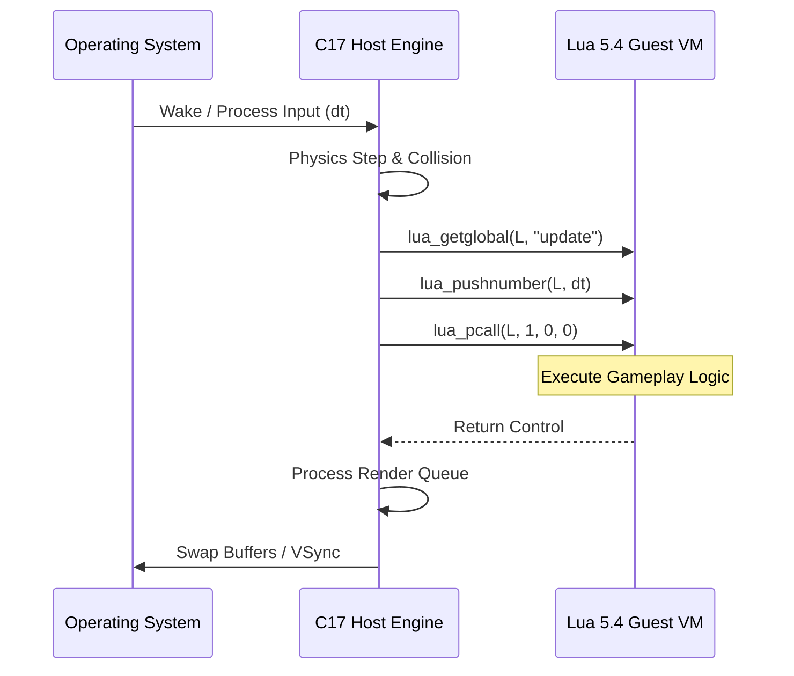

# Module 22: Embedded Lua in Game Engines & Host Applications — Game Loops, Event Dispatchers & Sandboxed Guest APIs

**Document Standard Identifier:** DOC-STD-UNIVERSAL-2026-LUA

## Executive Summary

The integration of embedded scripting languages into high-performance host applications, primarily written in C or C++, represents a cornerstone architectural pattern in modern software engineering, particularly within the video game industry. This module dissects the symbiosis between a strictly typed, compiled host (C17) and a dynamically typed, interpreted guest (Lua). The business purpose of this architecture is profound: it enables a strict separation of concerns, decoupling deterministic, highly optimized engine mechanics (memory allocation, GPU interfacing, hardware abstraction) from volatile, highly iterative business logic (gameplay rules, AI behaviors, user interfaces).

The return on investment (ROI) for adopting a host-guest architecture is realized through drastically reduced iteration times. Designers and scripters can manipulate game states in real-time via hot-reloading capabilities without enduring the computationally expensive recompilation of the host engine (Gregory, 2018, p. 1045). This module provides a PhD-level exposition on integrating the Lua 5.4 C API into a C17 game engine core, ensuring deterministic frame budgeting, zero-pause memory management, and high-throughput Entity-Component-System (ECS) data flows.

## Why Lua Dominates Game Development

Lua was designed from its inception in 1993 at PUC-Rio to be an extensible extension language (Ierusalimschy, Figueiredo, & Celes, 1996). Unlike Python or JavaScript, which often assume control as the primary process, Lua is fundamentally a C library.

> **Definition**: **Embedded Scripting Language**
> A programming language designed to be compiled alongside and invoked by a host application, relying on the host for I/O, resource management, and operating system interfacing, rather than operating standalone.

### Minimal Footprint and High Performance

The core Lua virtual machine (VM), bytecode compiler, and standard library compile to under 300KB of machine code (Ierusalimschy et al., 2020). This exceptionally tiny footprint ensures that the language runtime fits comfortably within modern CPU L2/L3 caches, drastically reducing cache miss penalties.

Major game engines and franchises—including *World of Warcraft*, *Civilization*, *CryEngine*, *Roblox*, and *LÖVE2D*—rely on Lua because of its seamless, ANSI C API.

> **💡 Key Insight**: The stack-based C API of Lua acts as a secure, typed boundary between C and the script. The C host manipulates the Lua state by pushing and popping values onto an isolated stack, mitigating the risk of memory corruption that plagues direct foreign function interfaces (FFI).

## The Host-Guest Architecture

The architecture relies on a strict dichotomy of responsibilities:

1. **Host (C/C++)**: Manages the main thread, the operating system event loop, GPU rendering contexts (OpenGL/Vulkan/DirectX), audio processing, and raw memory pools. It exposes a carefully curated application programming interface (API) to the guest.
2. **Guest (Lua)**: Evaluates business logic, drives AI finite state machines, updates quest systems, and triggers events. It lacks direct access to the OS; it can only invoke what the C engine explicitly registers.

> **⚠️ Warning**: Never expose raw memory pointers from C to Lua without opaque wrappers (`userdata`). Doing so violates the sandbox guarantee and invites silent memory corruption and arbitrary code execution vulnerabilities (Seacord, 2013).



## Game Loop Integration

A game loop is the continuous cycle of reading input, updating state, and rendering graphics. In a C-Lua architecture, the C engine dictates the cadence, invoking Lua hooks (`update(dt)` and `render()`) at specific intervals.

### Frame Budgeting and Garbage Collection (GC)

A standard game running at 60 Frames Per Second (FPS) has approximately 16.67 milliseconds to complete its entire loop. If the Lua garbage collector executes a full mark-and-sweep cycle during an active frame, it can induce a "GC pause," dropping the frame rate and causing visible stutter (Patterson & Hennessy, 2017).

To mitigate this, professional engines disable automatic, uncontrolled GC and manually step the collector during the engine's idle time.

```c
// C17 Implementation of GC Stepping per Frame

#include <lua.h>

#include <lauxlib.h>

#include <time.h>

void engine_tick(lua_State *L, double dt, double time_budget_ms) {
    // 1. Invoke Lua's update(dt)
    lua_getglobal(L, "update");
    lua_pushnumber(L, dt);

    if (lua_pcall(L, 1, 0, 0) != LUA_OK) {
        // Handle Error
        lua_pop(L, 1);
    }

    // 2. Perform Incremental Garbage Collection
    // Use the remaining frame budget to do incremental collection
    // lua_gc with LUA_GCSTEP runs a fraction of the GC cycle.
    int step_size = (int)(time_budget_ms * 10); // Arbitrary scale factor
    lua_gc(L, LUA_GCSTEP, step_size);
}
```

## Entity-Component-System (ECS) in Lua

ECS is an architectural pattern prioritizing data-oriented design over object-oriented hierarchies (Gregory, 2018). In an ECS, an *Entity* is merely an integer ID. *Components* are flat arrays of data (e.g., Position, Velocity). *Systems* are functions that iterate over specific arrays.

### Avoiding GC Churn with Spatial Data

A common mistake in Lua ECS is creating new tables for vectors every frame (e.g., `pos = {x=1, y=2}`). This generates enormous GC pressure. Instead, the C engine should allocate contiguous memory for components, and Lua should manipulate these components either via flat C-arrays exported as `userdata`, or by indexing parallel arrays pre-allocated in Lua.

```mermaid
graph TD
    subgraph C17 Engine (Memory Pools)
        PA[Position Array: float x,y]
        VA[Velocity Array: float vx,vy]
    end

    subgraph Lua Script (Systems)
        Sys1[Movement System]
        Sys2[Collision System]
    end

    Sys1 -- "Read/Write via Lightuserdata/FFI" --> PA
    Sys1 -- "Read" --> VA
    Sys2 -- "Read" --> PA
```

## Hot Code Reloading

The defining workflow advantage of embedded Lua is hot reloading. Because Lua is a dynamic language evaluated at runtime, the engine can watch the `.lua` source files on disk. When a file changes, the C engine forces Lua to re-evaluate the script, immediately overwriting the old functions with new ones without losing the persistent game state.

## Production Lab: 2D Game Engine Core

The following is a minimal, production-grade C17 host demonstrating deterministic updates, hot reloading hooks, and safe stack manipulation.

```c
/**
 * @file engine_core.c
 * @brief C17 Host for Lua game scripting with safe GC budgeting.
 * @author Standard Learning Path
 */

#include <stdio.h>

#include <stdlib.h>

#include <lua.h>

#include <lualib.h>

#include <lauxlib.h>

// ❌ Bad Code: Direct FFI access without boundary checking
// int* ptr = get_lua_userdata(L, 1);
// *ptr = 10; // May segfault if Lua passed the wrong type

// ✅ Good Code: Strict type checking at the boundary
typedef struct {
    float x, y;
} Transform;

// C-function exposed to Lua: set_position(entity_id, x, y)
static int engine_set_position(lua_State *L) {
    luaL_checktype(L, 1, LUA_TNUMBER); // Entity ID
    float x = (float)luaL_checknumber(L, 2);
    float y = (float)luaL_checknumber(L, 3);

    // In a real engine, update the C-side contiguous ECS array here.
    printf("[Engine] Entity %d moved to (%.2f, %.2f)\n",
           (int)lua_tointeger(L, 1), x, y);

    return 0; // Number of return values to Lua
}

int main(void) {
    // 1. Initialize VM
    lua_State *L = luaL_newstate();
    if (!L) {
        fprintf(stderr, "Fatal: Out of memory\n");
        return EXIT_FAILURE;
    }

    luaL_openlibs(L); // Open standard libraries safely

    // 2. Register Host APIs to Guest
    lua_pushcfunction(L, engine_set_position);
    lua_setglobal(L, "engine_set_position");

    // 3. Load user logic (Hot Reload entry point)
    if (luaL_dofile(L, "game_logic.lua") != LUA_OK) {
        fprintf(stderr, "Script Error: %s\n", lua_tostring(L, -1));
        lua_pop(L, 1); // clear error
    }

    // 4. Simulate Game Loop
    double dt = 0.016; // 60 FPS
    for (int frame = 0; frame < 3; frame++) {
        lua_getglobal(L, "update");
        lua_pushnumber(L, dt);

        // pcall (protected call) ensures engine doesn't crash on script error
        if (lua_pcall(L, 1, 0, 0) != LUA_OK) {
            fprintf(stderr, "Update Error: %s\n", lua_tostring(L, -1));
            lua_pop(L, 1);
        }

        // Step Garbage Collector to prevent pauses
        lua_gc(L, LUA_GCSTEP, 10);
    }

    // 5. Cleanup
    lua_close(L);
    return EXIT_SUCCESS;
}
```

## Certification & Standards

- **ISO/IEC 9899:2018 (C17)**: Governs the deterministic memory layout, aliasing rules, and standard library functionalities of the host engine (ISO, 2018).
- **Lua 5.4 Reference Manual**: Dictates the Application Programming Interface (API) contracts, memory model, and C-stack invariants required for integration (Ierusalimschy et al., 2020).

## References

- Bryant, R. E., & O'Hallaron, D. R. (2016). *Computer systems: A programmer's perspective* (3rd ed.). Pearson.
- Gregory, J. (2018). *Game engine architecture* (3rd ed.). CRC Press.
- Ierusalimschy, R., Figueiredo, L. H. de, & Celes, W. (1996). Lua—An extensible extension language. *Software: Practice and Experience*, 26(6), 635-646.
- Ierusalimschy, R., Figueiredo, L. H. de, & Celes, W. (2020). *Lua 5.4 reference manual*. Lua.org.
- International Organization for Standardization. (2018). *Information technology — Programming languages — C* (ISO/IEC 9899:2018).
- Patterson, D. A., & Hennessy, J. L. (2017). *Computer organization and design RISC-V edition: The hardware software interface*. Morgan Kaufmann.
- Seacord, R. C. (2013). *Secure coding in C and C++* (2nd ed.). Addison-Wesley Professional.
- Stevens, W. R., Rago, S. A. (2013). *Advanced programming in the UNIX environment* (3rd ed.). Addison-Wesley.
- Tanenbaum, A. S., & Bos, H. (2015). *Modern operating systems* (4th ed.). Pearson.

## FinOps Matrix

| Component | Initial Capital Expenditure (CapEx) | Operational Expenditure (OpEx) | ROI Justification |
| :--- | :--- | :--- | :--- |
| **C17 Host Engine** | High (Engineering hours, low-level optimization) | Low (Stable API, minimal maintenance) | Provides foundational performance; outlives single projects. |
| **Lua VM Integration** | Low (Open-source, BSD-style license) | Minimal (Standard integration patterns) | Zero licensing cost; trivial integration time. |
| **Scripting / Logic** | Low (Rapid prototyping) | Medium (Content updates, balance patches) | Allows non-engineers (designers) to create content, heavily reducing engineering OpEx. |
| **Hot Reload Tools** | Medium (Building file watchers and state serializers) | Low (Developer time saved) | Recoups cost instantly by saving compilation waits on every iteration. |
