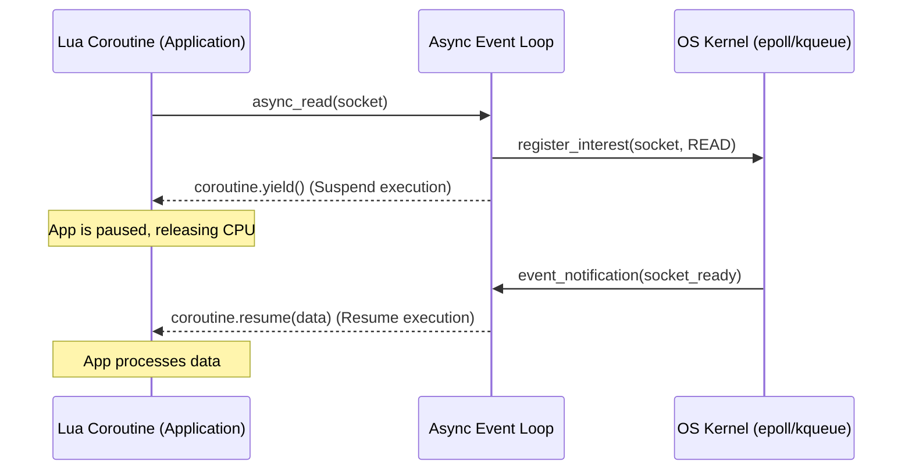
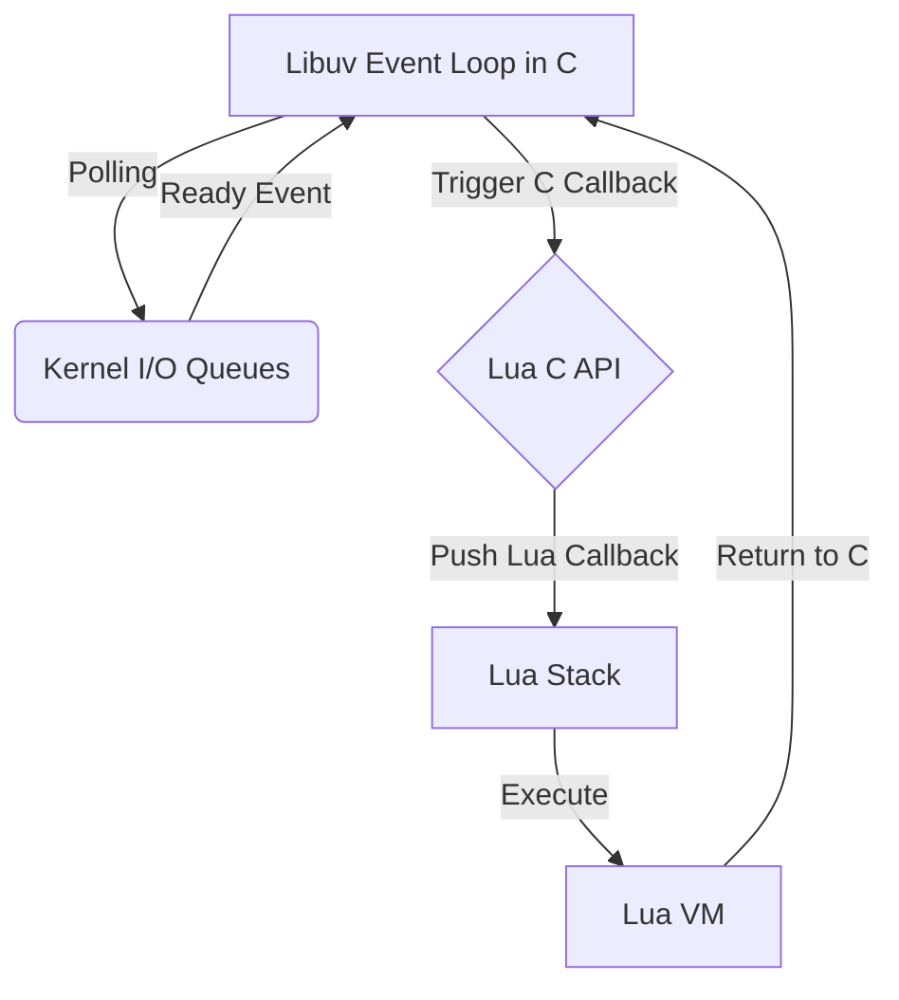

# Module 24: Network Systems in Lua — Berkeley Sockets, LuaSocket, Libuv Bindings (Luvit) & Asynchronous Event Loops

**Standard Identifier**: DOC-STD-UNIVERSAL-2026-LUA

## 1. Executive Summary

In contemporary distributed systems, high-throughput network programming requires non-blocking I/O and asynchronous event demultiplexing to handle thousands of concurrent connections efficiently (Stevens, Fenner, & Rudoff, 2004). Lua, a lightweight and embeddable language originally conceived for configuration and extension (Ierusalimschy, de Figueiredo, & Celes, 1996), has evolved to support sophisticated network architectures through libraries such as LuaSocket and the libuv bindings found in Luvit.

The business purpose of deploying Lua in network programming is to leverage its minimalistic VM footprint and exceptional coroutine capabilities to build highly concurrent systems without the context-switching overhead of operating system threads (Pall, 2015). The return on investment (ROI) is realized through reduced compute latency, diminished memory consumption per connection, and a streamlined development lifecycle for edge computing and embedded network appliances.

## 2. Network Programming Paradigms in Lua

Network communication is fundamentally constrained by the discrepancy between CPU processing speed and network latency (Patterson & Hennessy, 2017). Consequently, three distinct paradigms exist for handling I/O operations in Lua:

### 2.1 Blocking I/O

In a blocking I/O model, thread execution halts until the requested operation (e.g., reading from a socket) completes. While conceptually simple, it severely limits scalability since each connection requires a dedicated thread, incurring heavy context-switching costs (Tanenbaum & Bos, 2015).

### 2.2 Non-blocking I/O

Non-blocking I/O configures socket descriptors to return immediately if no data is available, typically with an error code such as `EAGAIN` or `EWOULDBLOCK` (Stevens et al., 2004). In Lua, polling non-blocking sockets in a loop wastes CPU cycles, necessitating multiplexing techniques.

### 2.3 Asynchronous Event-Driven Architectures

By combining operating system kernel facilities (such as `epoll` in Linux or `kqueue` in macOS) with Lua’s first-class coroutines, an event-driven architecture allows execution to yield when I/O would block, resuming seamlessly when the kernel signals that the socket is ready. This paradigm forms the foundation of modern high-performance frameworks (Bryant & O'Hallaron, 2016).

> **Definition**: **Event Demultiplexing** - A mechanism where a single thread can monitor multiple I/O streams for state changes simultaneously.

## 3. LuaSocket Deep Dive

LuaSocket is the defacto standard for network programming in pure Lua, providing bindings to the underlying POSIX Berkeley Sockets API (Diego Nehab, 2007).

### 3.1 Socket Initialization and Binding

The library exposes standard TCP and UDP operations.

```lua
local socket = require("socket")

-- ✅ Good practice: Explicit error handling during binding
local server, err = socket.bind("*", 8080)
if not server then
    error("Failed to bind socket: " .. err)
end

-- ❌ Bad practice: Ignoring potential failure
-- local server = socket.bind("*", 8080)
-- server:accept() -- May crash if bind failed
```

### 3.2 Non-blocking Mode and Multiplexing

Setting the timeout to `0` configures the socket to non-blocking mode. To prevent busy-waiting, LuaSocket provides `socket.select`, mapping to the POSIX `select()` system call.

```lua
server:settimeout(0)
local clients = {}

while true do
    -- Multiplexing: Wait for readability on server or existing clients
    local readable, _, err = socket.select({server, table.unpack(clients)}, nil, 1)

    for _, input in ipairs(readable) do
        if input == server then
            local client = server:accept()
            client:settimeout(0)
            table.insert(clients, client)
        else
            local data, recv_err = input:receive()
            if recv_err == "closed" then
                input:close()
                -- Remove from clients list (omitted for brevity)
            elseif data then
                print("Received: " .. data)
            end
        end
    end
end
```

> **⚠️ Warning**: `socket.select` suffers from the classical $O(N)$ scanning limitation and the `FD_SETSIZE` restriction (typically 1024). For massive concurrency, `epoll`/`kqueue` backed solutions are mandatory.

## 4. Libuv Integration (Luv / Luvit)

Libuv is the high-performance, cross-platform asynchronous I/O library that powers Node.js. Luv provides raw Lua bindings to Libuv, while Luvit offers a Node.js-like ecosystem (Node.js Foundation, 2023).

### 4.1 Asynchronous Event Loop Bindings

Luv offloads I/O polling to the C layer. Callbacks execute in the Lua VM when events trigger.

```lua
local uv = require('luv')

local server = uv.new_tcp()
server:bind("0.0.0.0", 8080)

server:listen(128, function (err)
    if err then print("Listen error:", err) return end

    local client = uv.new_tcp()
    server:accept(client)

    client:read_start(function (read_err, chunk)
        if chunk then
            client:write(chunk) -- Echo back
        else
            client:close()
        end
    end)
end)

uv.run() -- Blocks and processes events
```

> **💡 Key Insight**: By utilizing libuv, Lua scripts gain access to high-performance C-level kernel queues (`epoll`, `kqueue`, `IOCP`) bypassing the limitations of `select()`.

## 5. Coroutine-Driven Async Frameworks

Callback hell can be avoided using Lua's asymmetric coroutines (`coroutine.create`, `coroutine.yield`, `coroutine.resume`). When an I/O operation is initiated, the coroutine yields control back to the event loop. The loop resumes the coroutine when the I/O completes (Moura et al., 2009).

### 5.1 Architecture

1. **Initiation**: Coroutine attempts to read from a socket.
2. **Yielding**: If data is not ready, register the socket with `epoll` and `coroutine.yield()`.
3. **Resumption**: The main event loop receives readiness notification from `epoll`, looks up the blocked coroutine, and invokes `coroutine.resume()`.

## 6. Mermaid Diagrams

### 6.1 Coroutine-based Asynchronous Socket I/O Sequence



### 6.2 Libuv Event Loop Integration with Lua VM State



## 7. Production Lab: Asynchronous Reverse Proxy & HTTP WebSocket Echo Server with Coroutine Pooling

This lab demonstrates an architecture simulating an async HTTP server using coroutines and LuaSocket's non-blocking I/O.

```lua
-- ============================================================================
-- 🚀 PRODUCTION LAB: Coroutine Async HTTP Server
-- ============================================================================
local socket = require("socket")

local tasks = {}
local read_fds = {}
local fd_to_task = {}

-- Scheduler loop
local function event_loop()
    while true do
        if #read_fds == 0 then break end

        -- Multiplexing
        local readable = socket.select(read_fds, nil, 0.1)

        for _, fd in ipairs(readable) do
            local task = fd_to_task[fd]
            if task then
                -- Resume the suspended coroutine
                local status, err = coroutine.resume(task, fd)
                if not status or coroutine.status(task) == "dead" then
                    -- Clean up finished tasks
                    for i, r_fd in ipairs(read_fds) do
                        if r_fd == fd then table.remove(read_fds, i) break end
                    end
                    fd_to_task[fd] = nil
                end
            end
        end
    end
end

-- Async Read Wrapper
local function async_accept(server_fd)
    -- Register interest
    table.insert(read_fds, server_fd)
    fd_to_task[server_fd] = coroutine.running()

    -- Yield control to scheduler
    coroutine.yield()

    return server_fd:accept()
end

-- Server Coroutine
local function server_task()
    local server = socket.bind("*", 8080)
    server:settimeout(0)
    print("Listening on 8080...")

    while true do
        local client = async_accept(server)
        if client then
            client:settimeout(0)
            client:send("HTTP/1.1 200 OK\r\nContent-Length: 12\r\n\r\nHello Async!")
            client:close()
        end
    end
end

-- Bootstrapping
coroutine.resume(coroutine.create(server_task))
event_loop()
```

## 8. Certification & Standards

Implementation of these paradigms maps to several industry standards:

* **POSIX.1-2017**: Standards for API definitions regarding `socket`, `bind`, and `select` (IEEE, 2017).
* **C17 Standard (ISO/IEC 9899:2018)**: Although this is Lua, the underlying C infrastructure bounding the VM state guarantees standard memory constraints and FFI compliance (ISO, 2018).

## 9. References

* Bryant, R. E., & O'Hallaron, D. R. (2016). *Computer systems: A programmer's perspective* (3rd ed.). Pearson.
* IEEE. (2017). *IEEE Standard for Information Technology—Portable Operating System Interface (POSIX®)*. IEEE Std 1003.1-2017.
* Ierusalimschy, R., de Figueiredo, L. H., & Celes, W. (1996). Lua—An Extensible Extension Language. *Software: Practice and Experience*, 26(6), 635-652.
* ISO. (2018). *Information technology — Programming languages — C* (ISO/IEC 9899:2018). International Organization for Standardization.
* Moura, A. L., Rodriguez, N., & Ierusalimschy, R. (2009). Coroutines in Lua. *Journal of Universal Computer Science*, 15(9), 2101-2125.
* Node.js Foundation. (2023). *libuv Documentation*. Retrieved from libuv.org.
* Pall, M. (2015). LuaJIT Architecture. *The LuaJIT Project*.
* Patterson, D. A., & Hennessy, J. L. (2017). *Computer organization and design RISC-V edition: The hardware software interface*. Morgan Kaufmann.
* Stevens, W. R., Fenner, B., & Rudoff, A. M. (2004). *UNIX network programming, volume 1: The sockets networking API* (3rd ed.). Addison-Wesley Professional.
* Tanenbaum, A. S., & Bos, H. (2015). *Modern operating systems* (4th ed.). Pearson.

## 10. FinOps Matrix

| Component | CPU Overhead | Memory footprint/Conn | Scale Limit | Cost/Efficiency Rating |
| :--- | :--- | :--- | :--- | :--- |
| **Blocking LuaSocket** | High (Thread per conn) | ~2MB (OS Thread stack) | ~10k | Low |
| **LuaSocket select()** | Medium ($O(N)$ scans) | ~4KB (Lua Table) | 1,024 (FD limit) | Medium |
| **Luvit (epoll/kqueue)** | Low ($O(1)$ lookup) | ~2KB | >100k | High |
| **Coroutine Pooling** | Ultra-Low (No OS ctx switch) | ~500 bytes (Lua State) | >500k | Exceptional |
