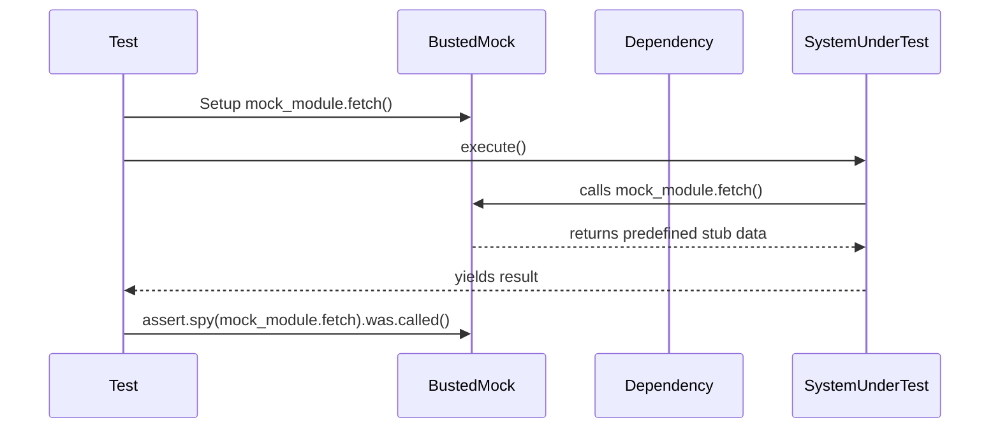
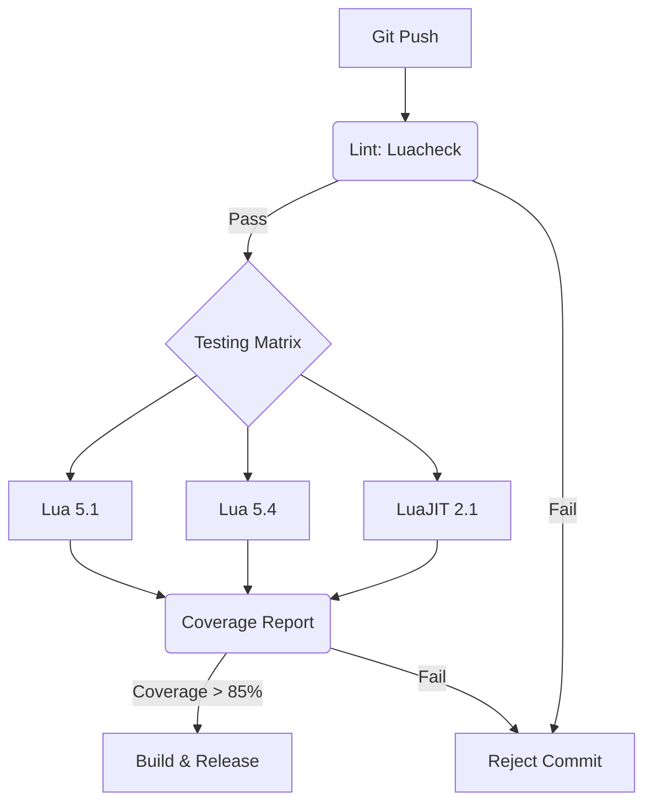

# Module 26: Software Quality & Testing in Lua — BDD Testing (Busted), Static Analysis (Luacheck), Mocking & CI Pipelines

**Standard Identifier:** DOC-STD-UNIVERSAL-2026-LUA

## Executive Summary

As dynamic languages such as Lua expand from embedded scripting domains into large-scale network services and microservices architecture, guaranteeing runtime stability without static type checking becomes paramount. This module establishes a rigorous framework for software quality and testing in Lua. By combining Behavior-Driven Development (BDD) via Busted, deep static analysis through Luacheck, precise execution coverage with LuaCov, and automated CI/CD matrices, engineering teams can drastically minimize production defects. The integration of these tools yields high Return on Investment (ROI) by identifying logical flaws during the development phase, eliminating entire classes of runtime errors—such as unintended global state mutations and nil-reference violations—before deployment.

## The Testing Problem in Dynamic Languages

Dynamically typed languages, including Lua, defer type checking and variable binding until runtime (Ierusalimschy, 2016). While this flexibility enables rapid prototyping and fluid data transformations, it fundamentally shifts the burden of correctness verification from the compiler to the developer.

> **Definition**: **Dynamic Typing Risk** is the probability that a program syntactically valid at parse time will experience a type or symbol resolution error during execution due to unexpected data flows or undeclared state changes.

In C or Rust, the compiler enforces structural integrity. In Lua, expressions like `user.name:upper()` will fail catastrophically if `user` or `user.name` is unexpectedly `nil`. Consequently, the absence of compile-time verification necessitates a layered quality assurance strategy comprising:

1. **Static Analysis (Linting):** Validating scope, syntax, and variable bindings preemptively.
2. **Automated Unit Testing:** Guaranteeing functions behave predictably under bounded inputs.
3. **Behavioral and Integration Testing:** Ensuring emergent behavior of interconnected modules fulfills business logic constraints.

> **💡 Key Insight**: In dynamic languages, test coverage is not merely a metric of completeness; it is the functional equivalent of a type checker. Untested code is unverified code.

## Busted — Behavior-Driven Development (BDD) Framework

Behavior-Driven Development (BDD) focuses on specifying the expected behavior of software in a domain-specific, natural language format. Busted is the premier BDD testing framework for Lua, providing elegant lexical scoping for test organization and an extensive assertion library (Olivine Labs, 2024).

### Test Scoping: `describe`, `it`, `before_each`, and `after_each`

Busted structures tests hierarchically. The `describe` blocks group related tests, `it` blocks define individual test cases, and `before_each`/`after_each` lifecycle hooks manage state isolation.

```lua
-- ✅ Good: Properly scoped and isolated tests
local target_module = require("api_client")

describe("API Client Behavior", function()
    local client

    before_each(function()
        -- Reset state before every test
        client = target_module.new("https://api.example.com")
    end)

    after_each(function()
        -- Teardown if necessary
        client:close()
    end)

    it("should correctly serialize payloads", function()
        local payload = { id = 1, name = "Test" }
        local json = client:serialize(payload)
        assert.is_string(json)
    end)
end)
```

### Assertions in Busted

Busted provides a robust assertion API extending the standard `assert()`.

* `assert.is_true(val)` / `assert.is_false(val)`
* `assert.are.same(expected, actual)`: Performs deep recursive table comparison.
* `assert.has_error(function, expected_message)`: Validates exception handling.

```lua
-- ✅ Good: Deep table comparison
it("should return a correctly mapped user object", function()
    local expected = { id = 100, profile = { role = "admin" } }
    local actual = process_user({ user_id = 100, role_id = 1 })

    assert.are.same(expected, actual) -- Deep comparison, not pointer equality
end)

-- ✅ Good: Error handling validation
it("should throw an error on invalid input", function()
    assert.has_error(function()
        process_user(nil)
    end, "Expected user object, got nil")
end)
```

### Spies, Stubs, and Mocks

To achieve true unit isolation, dependencies must be intercepted and controlled.

* **Spies:** Wrap existing functions to record arguments and call counts without altering behavior.
* **Stubs:** Replace functions entirely to return predefined values.
* **Mocks:** Intercept whole modules or objects, replacing all methods with spies or stubs.



```lua
-- ✅ Good: Using Spies and Stubs
it("should fetch user data using the http module", function()
    local http = require("http")

    -- Stub the request method to return a controlled payload
    stub(http, "request").returns('{"status":"ok"}')

    local result = fetch_remote_user()

    -- Verify the system under test interacted with the stub correctly
    assert.stub(http.request).was.called_with("GET", "/users/1")
    assert.are.equal("ok", result.status)

    -- Revert the stub to prevent test pollution
    http.request:revert()
end)
```

## Static Analysis with Luacheck

Luacheck is an advanced static analyzer for Lua that detects syntax errors, bad practices, and logical flaws before runtime.

### Detecting Global Variable Leaks

The most insidious bugs in Lua stem from unintentional global variables. If a developer forgets the `local` keyword, Lua implicitly creates a global variable.

> **⚠️ Warning**: Global variables pollute the environment, cause race conditions in concurrent runtimes (e.g., OpenResty), and introduce difficult-to-track side effects.

```lua
-- ❌ Bad: Accidental global leak
function calculate_sum(a, b)
    result = a + b -- 'result' is implicitly global!
    return result
end
```

Luacheck immediately flags this: `warning: accessing undefined variable 'result'`.

### Detecting Unused Variables and Shadows

Luacheck identifies unused variables (which waste memory and indicate logical errors) and shadowed variables (which obscure outer scopes).

```lua
-- ❌ Bad: Unused and shadowed variables
local x = 10
local function process(val)
    local x = 5 -- Luacheck: shadowing upvalue 'x'
    local unused_var = "test" -- Luacheck: unused variable 'unused_var'
    return val * x
end
```

### Configuring `.luacheckrc`

A rigorous quality pipeline enforces rules via `.luacheckrc`.

```lua
-- .luacheckrc
std = "lua51+luajit" -- Target environment
max_line_length = 100
ignore = {
    "212", -- Ignore unused arguments (often needed for callback signatures)
}
globals = {
    "ngx", -- Whitelist OpenResty globals
}
```

## Code Coverage with LuaCov

Coverage metrics quantify the percentage of source code executed during tests.

1. **Line Coverage:** Ensures every executable line is hit.
2. **Branch Coverage:** Ensures both true and false paths of `if/else` conditions are evaluated.

To run Busted with LuaCov:

```bash
busted --coverage
luacov
```

> **Definition**: A **Minimum Coverage Threshold** (typically 80-90%) is a mandated CI pipeline requirement ensuring that newly merged code does not reduce the overall verified footprint of the application.

## Continuous Integration (CI/CD) Architecture

A robust CI/CD pipeline tests Lua code against multiple engine versions. Lua 5.1, 5.2, 5.3, 5.4, and LuaJIT have subtle differences in garbage collection, bitwise operations, and environments.



### GitHub Actions Workflow

```yaml
name: Lua CI

on: [push, pull_request]

jobs:
  test:
    runs-on: ubuntu-latest
    strategy:
      matrix:
        luaVersion: ["5.1", "5.2", "5.3", "5.4", "luajit"]
    steps:
      - uses: actions/checkout@v3
      - name: Setup Lua
        uses: leafo/gh-actions-lua@v9
        with:
          luaVersion: ${{ matrix.luaVersion }}
      - name: Setup Luarocks
        uses: leafo/gh-actions-luarocks@v4
      - name: Install Dependencies
        run: |
          luarocks install busted
          luarocks install luacheck
          luarocks install luacov
      - name: Lint
        run: luacheck src/ spec/
      - name: Test & Coverage
        run: busted --coverage spec/
```

## Production Lab: A Complete Test Suite

Below is a robust example combining all discussed elements.

```lua
-- src/billing.lua
local billing = {}

function billing.process_payment(gateway, amount)
    if amount <= 0 then
        error("Invalid amount")
    end

    local success, receipt = gateway:charge(amount)
    if success then
        return { status = "success", id = receipt }
    else
        return { status = "failure", reason = "Gateway rejected" }
    end
end

return billing
```

```lua
-- spec/billing_spec.lua
local billing = require("src.billing")

describe("Billing Module", function()
    local mock_gateway

    before_each(function()
        mock_gateway = {
            charge = function() end
        }
    end)

    it("should process a valid payment successfully", function()
        stub(mock_gateway, "charge").returns(true, "RCPT_123")

        local result = billing.process_payment(mock_gateway, 100)

        assert.stub(mock_gateway.charge).was.called_with(mock_gateway, 100)
        assert.are.same({ status = "success", id = "RCPT_123" }, result)
    end)

    it("should handle gateway failures gracefully", function()
        stub(mock_gateway, "charge").returns(false, nil)

        local result = billing.process_payment(mock_gateway, 50)
        assert.are.equal("failure", result.status)
    end)

    it("should throw an error on negative amounts", function()
        assert.has_error(function()
            billing.process_payment(mock_gateway, -10)
        end, "Invalid amount")
    end)
end)
```

## Certification & Standards

* **ISO/IEC/IEEE 29119**: Software Testing standard emphasizing test processes, documentation, and techniques applicable to BDD in Lua.
* **DO-178C**: Software Considerations in Airborne Systems; while Lua is rarely used at Level A, static analysis (Luacheck) and structural coverage (LuaCov) satisfy objectives for lower criticality levels.

## References

* Ierusalimschy, R. (2016). *Programming in Lua* (4th ed.). Lua.org.
* Olivine Labs. (2024). *Busted: Lua Testing Framework*. Retrieved from <http://olivinelabs.com/busted/>
* Stroustrup, B. (2013). *The C++ Programming Language* (4th ed.). Addison-Wesley Professional. (Reference for strongly typed contrast).

## FinOps Matrix

| Quality Tool | Cost of Implementation | Defect Reduction Yield | CI Compute Overhead | ROI Horizon |
| :--- | :--- | :--- | :--- | :--- |
| **Luacheck** | Low (Trivial Setup) | High (Catches Globals) | Minimal (< 1s) | Immediate |
| **Busted Unit** | Medium (Writing Tests) | Very High (Logic Bugs) | Low (Fast execution) | 1-2 Sprints |
| **Busted Mocks** | Medium (Architecture refactor) | High (Isolates IO issues) | Low | 2-3 Sprints |
| **LuaCov** | Low (Plugin addition) | Medium (Identifies dead code) | Low | 1 Sprint |
| **CI Matrix** | High (Infrastructure Setup) | Critical (Environment sync) | High (Multiple VMs) | 3-6 Months |
