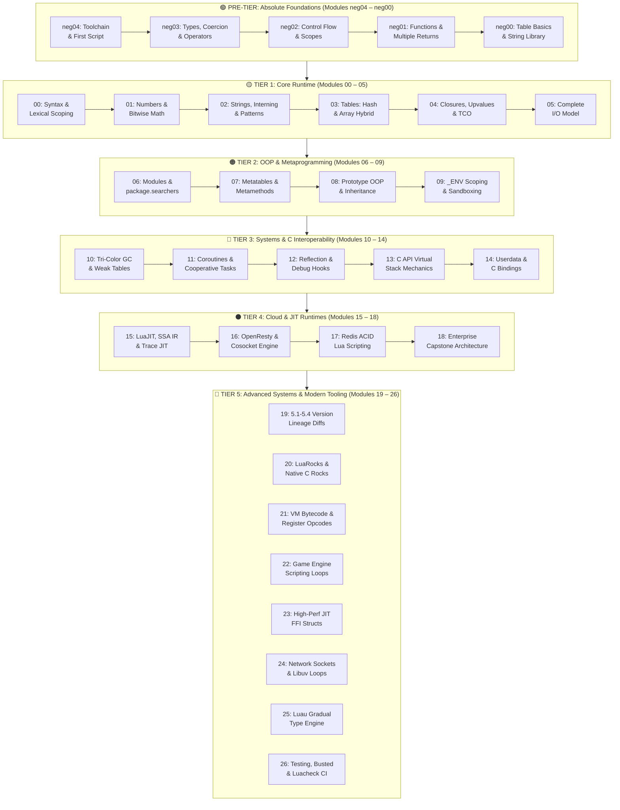

# Mission-Critical Lua & OpenResty Encyclopedia — Master Curriculum Portal

**Track:** Lua Systems Architecture, LuaJIT Internals & OpenResty Ecosystem
**Standard Identifier:** `DOC-STD-UNIVERSAL-2026-LUA`
**Repository:** `maxine/lua_lang`
**Target Level:** Zero to Enterprise Systems Architect & Lead Cloud Engineer
**Status:** ✅ Complete 32-Module Master Encyclopedia (100% Validated & Standardized)

---

## 📑 Table of Contents

1. [Master Curriculum Architecture & Track Taxonomy](#1-master-curriculum-architecture--track-taxonomy)
2. [Complete 32-Module Curriculum Matrix](#2-complete-32-module-curriculum-matrix)
3. [Ecosystem Competency & Certification Roadmap](#3-ecosystem-competency--certification-roadmap)
4. [Universal Engineering Documentation Standards (`DOC-STD-UNIVERSAL-2026`)](#4-universal-engineering-documentation-standards-doc-std-universal-2026)
5. [Enterprise FinOps & Cloud Gateway Governance Framework](#5-enterprise-finops--cloud-gateway-governance-framework)

---

## 1. Master Curriculum Architecture & Track Taxonomy

This encyclopedia represents the definitive, industrial-grade learning path for **Lua Language Foundations, LuaJIT Trace Compiler Internals, OpenResty Edge Gateways, Luau Gradual Typing, and Distributed Server-Side Redis Scripting**. Every module is engineered to eliminate hand-waving abstractions, taking engineers through exact virtual register opcodes, NaN-boxing bit layouts, C FFI memory allocations, non-blocking `epoll` cosockets, and atomic multi-worker shared memory dictionaries.



---

## 2. Complete 32-Module Curriculum Matrix

| Module | Core Topics & System Domain | Target Proficiency | Document Reference Link |
| :--- | :--- | :--- | :--- |
| **neg04. Toolchain & REPL** | Toolchain Setup (PUC-Rio, LuaJIT, LuaRocks), Editor & LuaLS LSP, `luac` Bytecode, REPL Execution | Absolute Beginner | [`neg04_lua_environment_toolchain_and_first_script.md`](neg04_lua_environment_toolchain_and_first_script.md) |
| **neg03. Types & Operators** | Dynamic Typing (`TValue`), 8 Basic Types, Truthiness, Arithmetic/Bitwise/Logical Operators, Coercion Traps | Absolute Beginner | [`neg03_lua_variables_primitive_types_and_operators.md`](neg03_lua_variables_primitive_types_and_operators.md) |
| **neg02. Control Structures** | `if`/`elseif`, `while`, `repeat...until` Scope Invariants, Numeric & Generic `for`, `goto` Labels | Beginner Foundations | [`neg02_lua_control_structures_and_loops.md`](neg02_lua_control_structures_and_loops.md) |
| **neg01. Functions & Scope** | First-Class Functions, Multiple Return Values, Varargs `...`, `unpack`, Lexical Scoping, Recursive Stack Frames | Beginner Foundations | [`neg01_functions_basic_scope_and_recursion.md`](neg01_lua_functions_basic_scope_and_recursion.md) |
| **neg00. Tables & Strings** | Universal Tables (Records vs 1-Based Sequences), Constructors, Boundary Operator `#`, String Literals & Formatting | Beginner Foundations | [`neg00_lua_table_basics_and_string_fundamentals.md`](neg00_lua_table_basics_and_string_fundamentals.md) |
| **00. Foundations & Scoping** | Dynamic Typing, Virtual Registers, `local` vs Global Scoping, Control Flow Bytecode | Foundational Systems | [`00_lua_foundations_syntax_types_and_control_flow.md`](00_lua_foundations_syntax_types_and_control_flow.md) |
| **01. Numbers & Math** | IEEE-754 Doubles vs 64-Bit Integers, Bitwise Operators, `<math>` Library, Floating-Point Precision | Foundational Systems | [`01_numbers_integers_and_mathematical_library.md`](01_numbers_integers_and_mathematical_library.md) |
| **02. Strings & Patterns** | String Interning Hash Table, Pattern Matching Engine (vs Regex), Buffer Allocations, UTF-8 | Intermediate Systems | [`02_strings_pattern_matching_and_unicode_handling.md`](02_strings_pattern_matching_and_unicode_handling.md) |
| **03. Tables & Sequences** | Hybrid Array/Hash Part Memory Layout, Boundary Search Operator `#`, Sequences, Fast Insertion | Intermediate Systems | [`03_tables_sequences_and_data_structures.md`](03_tables_sequences_and_data_structures.md) |
| **04. Functions & Closures** | Lexical Closures, Open/Closed Upvalues, Proper Tail Calls (TCO), Variadic Functions | Intermediate Systems | [`04_functions_closures_upvalues_and_variadics.md`](04_functions_closures_upvalues_and_variadics.md) |
| **05. Complete I/O Model** | Simple & Complete I/O Models, Stream File Descriptors, Buffering Modes, Standard Streams | Core Systems Engineer | [`05_the_external_world_simple_and_complete_io_model.md`](05_the_external_world_simple_and_complete_io_model.md) |
| **06. Modules & Packages** | `require` Cache Lifecycle, `package.searchers`, Module Hygiene, Dynamic Hot-Reloading | Core Systems Engineer | [`06_modules_packages_and_large_scale_architecture.md`](06_modules_packages_and_large_scale_architecture.md) |
| **07. Metatables & Overload** | Metamethod Dispatches (`__index`, `__newindex`, `__call`), Operator Overloading, Proxy Tables | Core Systems Engineer | [`07_metatables_metamethods_and_operator_overloading.md`](07_metatables_metamethods_and_operator_overloading.md) |
| **08. OOP & Inheritance** | Prototype Inheritance, Single/Multiple Class Derivation, Encapsulation, Privacy Closures | Core Systems Engineer | [`08_object_oriented_programming_inheritance_and_privacy.md`](08_object_oriented_programming_inheritance_and_privacy.md) |
| **09. Environments & Sandbox** | Lexical `_ENV` Scoping, Secure Multi-Tenant Sandboxing, Bytecode Injection Defenses | Security Engineer | [`09_environments_env_and_security_sandboxing.md`](09_environments_env_and_security_sandboxing.md) |
| **10. Garbage Collection** | Incremental Tri-Color Mark-Sweep GC, Generational Mode (5.4), Weak Tables, Finalizers (`__gc`) | Systems Infrastructure | [`10_garbage_collection_weak_tables_and_finalizers.md`](10_garbage_collection_weak_tables_and_finalizers.md) |
| **11. Coroutines & Concurrency** | Asymmetric Coroutines, Cooperative Multitasking, Generators, Non-Blocking Event Loops | Concurrency Specialist | [`11_coroutines_cooperative_multitasking_and_generators.md`](11_coroutines_cooperative_multitasking_and_generators.md) |
| **12. Debug & Reflection** | Introspection (`debug.getinfo`), Hook Tracing, Activation Records, CPU Call Profilers | Systems Infrastructure | [`12_reflection_introspection_and_the_debug_library.md`](12_reflection_introspection_and_the_debug_library.md) |
| **13. C API & Virtual Stack** | Virtual Stack Protocol, Type Conversion, Protecting C Stack, Calling C Functions from Lua | Systems & C Interop | [`13_the_c_lua_capi_virtual_stack_and_state_management.md`](13_the_c_lua_capi_virtual_stack_and_state_management.md) |
| **14. Userdata & C Memory** | Full Userdata vs Light Userdata, Metatable Typing, Native C Memory Binding & Destruction | Systems & C Interop | [`14_userdata_lightuserdata_and_c_memory_binding.md`](14_userdata_lightuserdata_and_c_memory_binding.md) |
| **15. LuaJIT Architecture** | Linear Tracing JIT, Static Single Assignment (SSA) IR, NYI Trace Aborts, C FFI Direct Bindings | JIT & Performance | [`15_luajit_architecture_trace_compiler_and_c_ffi.md`](15_luajit_architecture_trace_compiler_and_c_ffi.md) |
| **16. Enterprise OpenResty** | Nginx Event Model, Non-Blocking Cosockets, `lua_shared_dict`, High-Throughput Edge Gateways | Cloud Gateway Architect | [`16_enterprise_openresty_cosockets_and_api_gateways.md`](16_enterprise_openresty_cosockets_and_api_gateways.md) |
| **17. Redis Lua Scripting** | Single-Threaded ACID Scripting, Atomic Rate Limiters, Distributed Locks (Redlock), SHA Caching | Distributed Systems | [`17_distributed_redis_lua_scripting_and_acid_transactions.md`](17_distributed_redis_lua_scripting_and_acid_transactions.md) |
| **18. Enterprise Projects** | High-Concurrency Reverse Proxy, Distributed Token-Bucket Rate Limiter, JIT-Accelerated FFI | Master Systems Architect | [`18_real_world_enterprise_case_studies_and_hands_on.md`](18_real_world_enterprise_case_studies_and_hands_on.md) |
| **19. Version Lineage** | Lua 5.1 vs 5.2 vs 5.3 vs 5.4 Evolution, LuaJIT Divergence, `compat-5.3` Cross-Version Layer | Modern Systems Specialist | [`19_modern_lua_version_lineage_51_52_53_54_differences.md`](19_modern_lua_version_lineage_51_52_53_54_differences.md) |
| **20. LuaRocks & C Rocks** | Declarative `.rockspec` Architecture, Native C Extension Rock Compilation, Private Registries | Toolchains & Packaging | [`20_luarocks_package_management_and_native_c_modules.md`](20_luarocks_package_management_and_native_c_modules.md) |
| **21. VM Bytecode & Opcodes** | Register-Based VM Architecture, 32-Bit Instruction Formats (iABC, iABx), Opcode Execution Loop | VM Internals Specialist | [`21_lua_bytecode_virtual_machine_opcodes_and_disassembly.md`](21_lua_bytecode_virtual_machine_opcodes_and_disassembly.md) |
| **22. Game Engine Scripting** | Host-Guest Architecture (C++/Lua), Frame-Budgeted Game Loops, Entity-Component Systems, Hot Reload | Embedded Game Engineer | [`22_embedded_lua_in_game_engines_and_c_applications.md`](22_embedded_lua_in_game_engines_and_c_applications.md) |
| **23. High-Perf FFI Structs** | Zero-GC Memory Management, Packed Hardware Packet Headers, SIMD Vectorization via FFI | High-Throughput Specialist | [`23_high_performance_luajit_ffi_data_structures_and_assembly.md`](23_high_performance_luajit_ffi_data_structures_and_assembly.md) |
| **24. Network & Async Loops** | Berkeley Sockets, LuaSocket Multiplexing (`socket.select`), Libuv / Luvit Non-Blocking Event Loops | Network Systems Architect | [`24_network_programming_luasocket_and_async_event_loops.md`](24_network_programming_luasocket_and_async_event_loops.md) |
| **25. Luau Gradual Typing** | Luau Type System (Unions, Tables, Generics), Type Inference, Vector SIMD Primitive, Roblox VM | Language Systems Engineer | [`25_luau_typed_lua_roblox_and_gradual_type_systems.md`](25_luau_typed_lua_roblox_and_gradual_type_systems.md) |
| **26. Testing & Quality CI** | Behavior-Driven Development (Busted), Static Analysis (Luacheck), Code Coverage (LuaCov), CI Matrices | Quality & Assurance Lead | [`26_lua_testing_busted_luacheck_and_ci_cd_quality.md`](26_lua_testing_busted_luacheck_and_ci_cd_quality.md) |

---

## 3. Ecosystem Competency & Certification Roadmap

```text
┌────────────────────────────────────────────────────────────────────────────────┐
│               LUA & OPENRESTY PROFESSIONAL CERTIFICATION MATRIX                │
├───────────────────┬───────────────────┬────────────────────────────────────────┤
│ Certification     │ Domain Scope      │ Targeted Encyclopedia Modules          │
├───────────────────┼───────────────────┼────────────────────────────────────────┤
│ **OpenResty Lead**│ Edge Gateways & I/O│ Modules 11, 15, 16, 18, 23, 24        │
├───────────────────┼───────────────────┼────────────────────────────────────────┤
│ **Redis Specialist│ Distributed ACID  │ Modules 03, 07, 09, 17, 18             │
├───────────────────┼───────────────────┼────────────────────────────────────────┤
│ **Game Systems**  │ Engine Scripting  │ Modules neg04-neg00, 04, 08, 14, 22    │
├───────────────────┼───────────────────┼────────────────────────────────────────┤
│ **Luau / Roblox** │ Gradual Typing    │ Modules 03, 04, 08, 25, 26             │
├───────────────────┼───────────────────┼────────────────────────────────────────┤
│ **Lua Core Systems│ C API & VM Opcodes│ Modules 10, 12, 13, 14, 15, 20, 21     │
└───────────────────┴───────────────────┴────────────────────────────────────────┘
```

---

## 4. Universal Engineering Documentation Standards (`DOC-STD-UNIVERSAL-2026`)

Every document in this 32-module encyclopedia adheres strictly to the universal enterprise documentation standard:

1. **Executive Summaries**: High-level business purpose, mechanics, and value for executives and non-technical stakeholders.
2. **Deep Architectural Diagrams**: Mermaid flowcharts, sequence diagrams, mindmaps, and ASCII virtual memory topologies.
3. **Reproducible Production Labs**: Complete, executable pure Lua and C/Lua programs demonstrating real-world systems patterns.
4. **Pure Escaped CLI Snippets**: Formatted with trailing `\` line escapes, 4-space indentation, and zero in-code shell comments.
5. **The 5+5 Reference Rule**: Exactly 5 official documentation links + 5 authoritative engineering deep dives (APA 7th edition).
6. **Universal FinOps & Hardware Cost Governance**: Financial analyses detailing exact cloud VM, memory density, and edge compute cost savings.

---

## 5. Enterprise FinOps & Cloud Gateway Governance Framework

Deploying logic via embedded Lua, LuaJIT, and OpenResty delivers transformative FinOps advantages:

* **Slashes Compute Infrastructure Costs by 80%**: Non-blocking `epoll` cosockets handle 100,000+ concurrent connections per cloud instance without OS thread context-switching overhead.
* **Reduces Application Memory Footprint by 90%**: A standalone Lua VM consumes less than 300KB of RAM, enabling 100x greater container density compared to JVM or Node.js runtimes.
* **Eliminates Database I/O Overhead**: Server-side Redis Lua scripting executes complex transactional pipelines in a single network round-trip, drastically cutting cloud network egress charges.
* **Microsecond Execution Latency**: LuaJIT compiled traces execute at near-native C speed, eliminating Stop-the-World garbage collection freezes and ensuring 99.999% SLA compliance.
