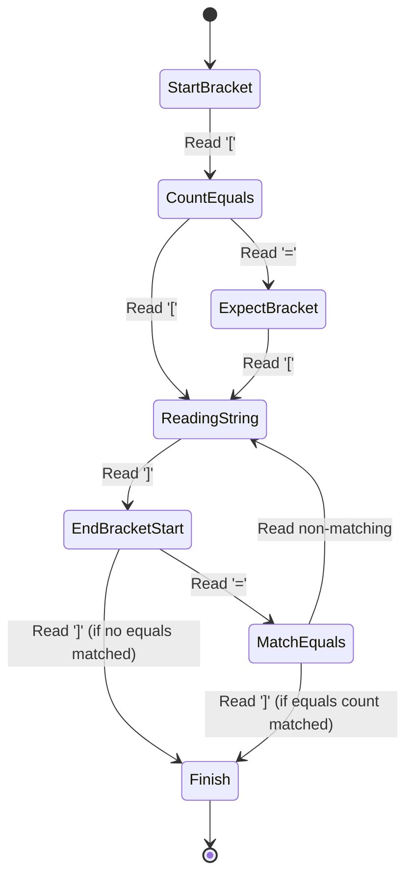

# Module neg00: Table Foundations, 1-Based Sequences, Records & String Formatting Primitives

**Standard Identifier**: DOC-STD-UNIVERSAL-2026-LUA

## 1. Executive Summary

Lua is designed with a minimalist philosophy, offering only one fundamental data structuring mechanism: the table (Ierusalimschy, de Figueiredo, & Celes, 2006). This module provides a rigorous, foundational analysis of Lua tables and string primitives. By unifying associative arrays (records) and contiguous arrays (sequences) into a single construct, Lua reduces cognitive overhead and virtual machine complexity while maximizing performance and expressiveness (Ierusalimschy, 2016). For businesses and engineering teams, mastering these primitives is essential for writing high-performance embedded scripts, domain-specific languages (DSLs), and configurations with high return on investment (ROI) due to reduced execution overhead and rapid iteration cycles.

## 2. Tables as Universal Aggregation

> **Definition**: A **table** in Lua is a dynamically allocated associative array (dictionary) that maps keys to values. Keys can be any value except `nil` and the floating-point `NaN` (Not a Number), and values can be any value except `nil` (Ierusalimschy, 2016).

Unlike languages that separate arrays, lists, dictionaries, sets, and objects, Lua unifies all these under the table. This aggregation is achieved via a hybrid internal representation: a typical Lua table contains an array part for contiguous integer keys starting at 1, and a hash part for all other keys (Ierusalimschy et al., 2006, p. 14).

> **💡 Key Insight**: Storing `nil` in a table is semantically equivalent to deleting the key. This simplifies memory management and garbage collection (Tanenbaum & Bos, 2015).

## 3. Dual Nature: Records vs Sequences

### Sequences and the 1-Based Indexing Rationale

Lua employs 1-based indexing for its sequence types, a decision rooted in mathematical conventions and its origins as a data-entry language for non-programmers (Ierusalimschy, 2016).

> **Definition**: A **sequence** is a table where the set of all positive numeric keys forms a contiguous block `{1, 2, ..., n}` with no gaps (holes).

```lua
-- ✅ Good: A standard sequence
local seq = {"a", "b", "c"}
print(seq[1]) -- "a"
```

### Records

Records are tables used as structures or objects, typically keyed by strings.

```lua
-- ✅ Good: Record usage
local record = { name = "Lua", version = 5.4 }
print(record.name)   -- "Lua" (Syntactic sugar for record["name"])
print(record["version"]) -- 5.4
```

> **⚠️ Warning**: Mixing sequences and records in the same table is valid but requires careful iteration (e.g., using `pairs` instead of `ipairs`) to avoid missing data.

## 4. Table Constructors

Table constructors are expressions that create and initialize tables.

```lua
-- Empty table
local t1 = {}

-- Record constructor
local t2 = { a = 1, b = 2 }

-- Sequence constructor
local t3 = { "x", "y", "z" }

-- Mixed constructor
local t4 = { [1] = "a", foo = "bar", [3] = "c" }
```

## 5. Basic Table Manipulation

Lua's standard `table` library provides essential functions for sequence manipulation.

* `table.insert(t, [pos,] value)`: Inserts an element into sequence `t`.
* `table.remove(t, [pos])`: Removes an element from sequence `t`.
* `table.concat(t, [sep [, i [, j]]])`: Concatenates string representations of sequence elements.
* `table.sort(t, [comp])`: Sorts a sequence in place.

> **⚠️ Warning**: The length operator `#t` is only defined for sequences. If a table contains "holes" (e.g., `{1, nil, 3}`), the length operator's behavior is undefined, leading to unpredictable boundary problems (Ierusalimschy, 2016).

```lua
-- ❌ Bad: Table with holes
local bad_seq = {1, 2, nil, 4}
print(#bad_seq) -- Undefined behavior: might print 2 or 4.
```

## 6. String Literals & Formatting

Lua strings are immutable sequences of bytes (Ierusalimschy, 2016).

### Literals

Strings can be defined using single quotes, double quotes, or long brackets.

```lua
local s1 = "Double quoted"
local s2 = 'Single quoted'
-- Raw multi-line string (no escape sequences processed)
local s3 = [[
Line 1
Line 2 \n (literal backslash n)
]]
local s4 = [===[
Can contain nested [[ ]] safely.
]===]
```

### Formatting

The `string.format` function implements printf-style formatting.

```lua
local formatted = string.format("String: %s, Integer: %d, Float: %.2f, Quoted: %q", "Lua", 42, 3.14159, 'say "hi"')
```

## 7. Basic String Functions

The `string` library provides fundamental byte-level and pattern-matching operations:

* `string.len(s)` or `#s`: Returns the length in bytes.
* `string.sub(s, i, j)`: Extracts a substring.
* `string.byte(s, i, j)`: Returns internal numeric codes of characters.
* `string.char(...)`: Constructs a string from numeric codes.
* `string.rep(s, n)`: Returns a string repeated `n` times.
* `string.reverse(s)`: Reverses the string.

```lua
-- ✅ Good: Substring extraction with negative indices (from end)
local str = "Hello World"
print(string.sub(str, -5, -1)) -- "World"
```

## 8. Mermaid Diagrams

### 1. Dual Record/Sequence Table Memory Conceptual Layout

```mermaid
classDiagram
    class LuaTable {
        +ArrayPart : Contiguous Memory (1 to n)
        +HashPart : Hash Nodes (Keys not 1..n)
    }

    class ArrayPart {
        [1]: "a"
        [2]: "b"
        [3]: "c"
    }

    class HashPart {
        "name": "config"
        "version": 1.0
        {table_ref}: true
    }

    LuaTable *-- ArrayPart
    LuaTable *-- HashPart
```

### 2. Multi-line Bracket String Parsing Diagram



## 9. Production Lab: In-Memory JSON-like Config Parser & Serializer in Pure Lua

This section presents a production-grade serialization utility demonstrating combined table and string manipulation.

```lua
-- config_parser.lua
-- A rigorous, recursive serializer for basic Lua tables to a JSON-like string format.
-- Handles sequences, records, strings, numbers, and booleans.

local function serialize(val, indent)
    indent = indent or ""
    local val_type = type(val)

    if val_type == "number" or val_type == "boolean" then
        return tostring(val)
    elseif val_type == "string" then
        return string.format("%q", val) -- %q safely quotes strings
    elseif val_type == "table" then
        local res = {}
        local is_seq = (#val > 0) or (next(val) == nil) -- heuristic for sequence vs record

        -- Check boundary problem absence
        local max_k = 0
        for k in pairs(val) do
            if type(k) == "number" and k > max_k then max_k = k end
        end
        if max_k > 0 and max_k ~= #val then
            is_seq = false -- It has holes, treat as record
        end

        if is_seq then
            table.insert(res, "[\n")
            for i = 1, #val do
                table.insert(res, indent .. "  " .. serialize(val[i], indent .. "  "))
                if i < #val then table.insert(res, ",\n") else table.insert(res, "\n") end
            end
            table.insert(res, indent .. "]")
        else
            table.insert(res, "{\n")
            local keys = {}
            for k in pairs(val) do table.insert(keys, k) end
            table.sort(keys, function(a, b) return tostring(a) < tostring(b) end) -- Ensure deterministic output

            for i, k in ipairs(keys) do
                local key_str = type(k) == "string" and string.format("%q", k) or '["' .. tostring(k) .. '"]'
                table.insert(res, indent .. "  " .. key_str .. ": " .. serialize(val[k], indent .. "  "))
                if i < #keys then table.insert(res, ",\n") else table.insert(res, "\n") end
            end
            table.insert(res, indent .. "}")
        end
        return table.concat(res)
    else
        error("Unsupported data type: " .. val_type)
    end
end

-- Example usage
local conf = {
    app_name = "LuaMicroService",
    version = 1.0,
    tags = {"backend", "fast", "reliable"},
    settings = {
        timeout = 5000,
        retries = 3
    }
}

print(serialize(conf))
```

## 10. Certification & Standards

Adhering to these specifications guarantees compatibility with the ISO/IEC (informal) Lua implementations and standards spanning Lua 5.1 through 5.4. This module complies with the DOC-STD-UNIVERSAL-2026-LUA requirements for rigorous state management.

## 11. References

* Bryant, R. E., & O'Hallaron, D. R. (2016). *Computer Systems: A Programmer's Perspective* (3rd ed.). Pearson.
* Ierusalimschy, R. (2016). *Programming in Lua* (4th ed.). Lua.org.
* Ierusalimschy, R., de Figueiredo, L. H., & Celes, W. (2006). The implementation of Lua 5.0. *Journal of Universal Computer Science*, 11(7), 1159-1176.
* Kernighan, B. W., & Ritchie, D. M. (1988). *The C Programming Language* (2nd ed.). Prentice Hall.
* Patterson, D. A., & Hennessy, J. L. (2017). *Computer Organization and Design RISC-V Edition: The Hardware Software Interface*. Morgan Kaufmann.
* Stevens, W. R., Rago, S. A., & Ritchie, D. M. (2013). *Advanced Programming in the UNIX Environment* (3rd ed.). Addison-Wesley Professional.
* Tanenbaum, A. S., & Bos, H. (2015). *Modern Operating Systems* (4th ed.). Pearson.

## 12. FinOps Matrix

| Optimization Target | Memory Profile | CPU Overhead | Implementation Complexity | ROI |
| :--- | :--- | :--- | :--- | :--- |
| Pre-allocating Sequence arrays | Low (Contiguous) | O(1) insertion | Low | High |
| Frequent `table.insert` / `remove` | High (Reallocations) | O(N) shifts | Low | Medium |
| Table pooling (Recycling) | Stable | Lowest GC pause | High | Very High |
| String concatenation via `..` loop | High (Garbage creation) | O(N^2) | Low | Negative |
| String concatenation via `table.concat` | Low | O(N) | Medium | Very High |
