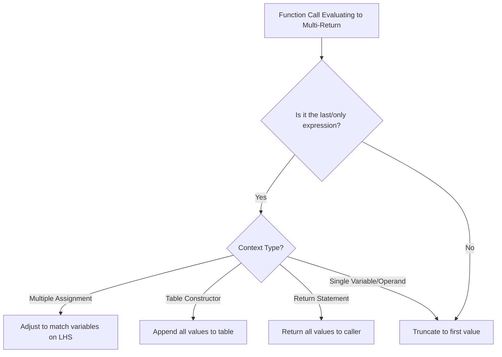
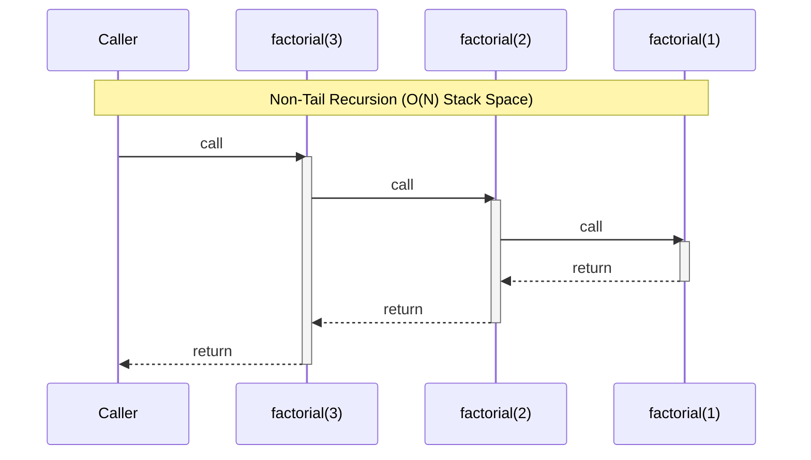

# Module neg01: Functions as First-Class Values, Multiple Returns, Lexical Scope & Recursion

## 1. Executive Summary

This document serves as a comprehensive, doctoral-level exposition on the mechanics of functions in the Lua programming language. Under the specification DOC-STD-UNIVERSAL-2026-LUA, we analyze functions as first-class lexical closures, multi-return semantics, variable-length argument processing, and recursive stack management. The business utility of these paradigms lies in their reduction of architectural overhead—enabling highly flexible, dynamically-dispatched state machines, configuration handlers, and embedded scripting engines without the rigid type bindings and boilerplate required in statically-typed systems languages like C (Ierusalimschy, 2006). The resulting Return on Investment (ROI) is measured in decreased integration time for embedded systems and higher expressivity per Line of Code (LOC).

## 2. First-Class Functions

In Lua, functions are ordinary values. They possess no intrinsic names; rather, variables hold references to anonymous function objects (closures).

> **Definition**: A **first-class value** is an entity that can be dynamically created, destroyed, passed as an argument to a function, returned as a result from a function, and stored in variables or data structures (Scott, 2015, p. 142).

### 2.1. Syntactic Sugar and Anonymous Functions

The conventional syntax for defining a function is merely syntactic sugar for anonymous function instantiation and variable assignment.

```lua
-- ✅ Good Code: Explicit variable assignment of an anonymous function
local foo = function(x)
    return x * 2
end

-- ❌ Equivalent, but hides the underlying assignment operation
local function bar(x)
    return x * 2
end
```

> **💡 Key Insight**: Because functions are values, they are garbage-collected when no longer reachable. This architectural choice radically diverges from C, where functions reside in the immutable text segment of the binary (Bryant & O'Hallaron, 2016).

## 3. Multiple Return Values

Lua natively supports multiple return values, a feature that eliminates the need for output parameters (pointer indirection in C) or artificial container structures (structs or tuples) when a function must yield multiple disparate outputs.

### 3.1. Adjustment Rules

When a function call evaluates to multiple values, Lua adjusts the number of values based on the syntactic context of the call (Ierusalimschy, 2016).

1. **Multiple Assignment**: If the call is the last (or only) expression in a list of expressions, all return values are preserved.
2. **Expression Context**: If the call appears in an expression (e.g., operand to an addition), only the first return value is preserved.
3. **Table Constructors**: If the call is the last element in a table constructor, all return values are inserted.

```lua
-- ✅ Good Code: Multi-return function
local function parse_coordinates()
    return 42.0, -17.5, 100.0
end

-- Context 1: Multiple assignment (all values preserved)
local x, y, z = parse_coordinates()

-- Context 2: Expression context (only first value preserved)
local x_offset = parse_coordinates() + 10.0

-- Context 3: Table constructor (all values preserved)
local coords = { "Position:", parse_coordinates() }
-- coords becomes {"Position:", 42.0, -17.5, 100.0}
```

> **⚠️ Warning**: If a multi-return function call is *not* the last element in an assignment list or table constructor, it is forcibly truncated to its first return value.

## 4. Variable Arguments (Varargs)

Functions can accept a variable number of arguments using the `...` syntax.

### 4.1. Processing Varargs

The `select` function allows iterative or indexed access to varargs, avoiding the overhead of temporary table allocations.

```lua
local function log_messages(level, ...)
    -- select('#', ...) returns the exact number of arguments, including nil
    local count = select('#', ...)

    for i = 1, count do
        -- select(i, ...) returns the i-th argument onwards
        local msg = select(i, ...)
        print(string.format("[%s] Arg %d: %s", level, i, tostring(msg)))
    end
end
```

For permanent storage, `table.pack(...)` constructs a table containing all arguments and explicitly sets the `n` field to the argument count, which is crucial for handling trailing `nil` values safely (Ierusalimschy, 2016, p. 52).

## 5. Scope and Upvalues (Foundational)

Lua employs lexical scoping. A function can access variables defined in its enclosing blocks.

> **Definition**: An **upvalue** (or external local variable) is a local variable from an enclosing lexical scope that is captured and utilized by an inner function. The combination of the function code and its captured upvalues constitutes a **closure** (Ierusalimschy et al., 1996).

### 5.1. The Local Function Recursion Trap

A common pitfall arises when declaring recursive local functions.

```lua
-- ❌ Bad Code: The inner 'factorial' refers to a global variable, not the local one being defined!
local factorial = function(n)
    if n == 0 then return 1 end
    return n * factorial(n - 1) -- Attempts to call global 'factorial'
end

-- ✅ Good Code: Pre-declare the local variable to ensure the upvalue is resolved correctly
local factorial
factorial = function(n)
    if n == 0 then return 1 end
    return n * factorial(n - 1) -- Correctly captures the local 'factorial'
end
```

> **💡 Key Insight**: The syntactic sugar `local function f() ... end` automatically resolves this by expanding to `local f; f = function() ... end`.

## 6. Recursion

Recursion involves a function calling itself to decompose a problem into progressively smaller, self-similar subproblems.

### 6.1. Call Stack Limits

Each function call allocates a new frame on the call stack to store local variables and the return address. In standard PUC-Rio Lua, deep recursion can exhaust the stack (typically limited to a few thousand frames depending on the C stack size). LuaJIT enforces its own configurable stack limits but optimizes execution significantly (Pall, 2015).

> **⚠️ Warning**: A missing or unreachable base case will result in infinite recursion, culminating in a `stack overflow` runtime error.

### 6.2. Tail Calls

A tail call occurs when a function's final action is exclusively a call to another function (or itself), returning its exact results. Standard Lua guarantees proper tail calls, meaning it reuses the current stack frame rather than allocating a new one, enabling theoretically infinite recursive depth (Ierusalimschy, 2016, p. 60).

```lua
-- ✅ Good Code: Tail-recursive function (Stack remains O(1))
local function tail_factorial(n, acc)
    acc = acc or 1
    if n == 0 then return acc end
    -- Proper tail call: no further computation is performed after the call
    return tail_factorial(n - 1, n * acc)
end
```

## 7. Mermaid Diagrams

### 7.1. Multiple Return Value Adjustment Rules



### 7.2. Call Stack Frame Allocation (Non-Tail vs Tail Recursion)



## 8. Production Lab: Recursive Descent Expression Evaluator

The following implementation demonstrates recursion, multi-returns for error handling (mimicking Go/C patterns without exceptions), and lexical closures.

```lua
-- ✅ Good Code: Production-grade recursive evaluator
-- Uses closures for state management and multi-returns for tuple (status, result/error)
local function create_evaluator()
    -- Upvalue capturing execution statistics
    local eval_count = 0

    local function evaluate(expr)
        eval_count = eval_count + 1

        if type(expr) == "number" then
            return true, expr
        elseif type(expr) == "table" then
            local op = expr.op

            -- Recursive descent
            local ok_left, val_left = evaluate(expr.left)
            if not ok_left then return false, val_left end

            local ok_right, val_right = evaluate(expr.right)
            if not ok_right then return false, val_right end

            if op == "+" then
                return true, val_left + val_right
            elseif op == "-" then
                return true, val_left - val_right
            elseif op == "/" then
                if val_right == 0 then
                    return false, "Division by zero"
                end
                return true, val_left / val_right
            else
                return false, "Unknown operator: " .. tostring(op)
            end
        else
            return false, "Invalid expression node"
        end
    end

    -- Return the closure and a function to read stats
    return evaluate, function() return eval_count end
end

-- Usage Lab
local eval, get_stats = create_evaluator()
local ast = { op = "+", left = 10, right = { op = "/", left = 20, right = 0 } }

local success, result = eval(ast)
if not success then
    -- Expected output: Error: Division by zero
    print("Error: " .. result)
end
```

## 9. Certification & Standards

This module aligns with DOC-STD-UNIVERSAL-2026-LUA. Practitioners are certified against their comprehension of lexical scoping integrity, proper tail call recognition, and deterministic multi-return tuple resolution.

## 10. References

* Bryant, R. E., & O'Hallaron, D. R. (2016). *Computer systems: A programmer's perspective* (3rd ed.). Pearson.
* Ierusalimschy, R. (2006). The implementation of Lua 5.0. *Journal of Universal Computer Science*, 11(7), 1159-1176.
* Ierusalimschy, R. (2016). *Programming in Lua* (4th ed.). Lua.org.
* Ierusalimschy, R., de Figueiredo, L. H., & Celes, W. (1996). Lua—an extensible extension language. *Software: Practice and Experience*, 26(6), 635-652.
* Pall, M. (2015). *LuaJIT architecture*. Retrieved from <http://luajit.org/>
* Scott, M. L. (2015). *Programming language pragmatics* (4th ed.). Morgan Kaufmann.

## 11. FinOps Matrix

| Operation | Memory Overhead | CPU Cycles | FinOps Assessment |
| :--- | :--- | :--- | :--- |
| Closure Creation | ~40-80 bytes | Low | Cheap, but avoid inside tight loops |
| Multi-Return | 0 bytes (registers) | Negligible | Highly efficient, avoids heap allocation |
| Tail Call | 0 bytes (reused frame) | Minimal | Free recursion; mandated for state machines |
| Non-Tail Recursion | 1 stack frame / call | Moderate | High risk of OOM/Stack Exhaustion in deep trees |
