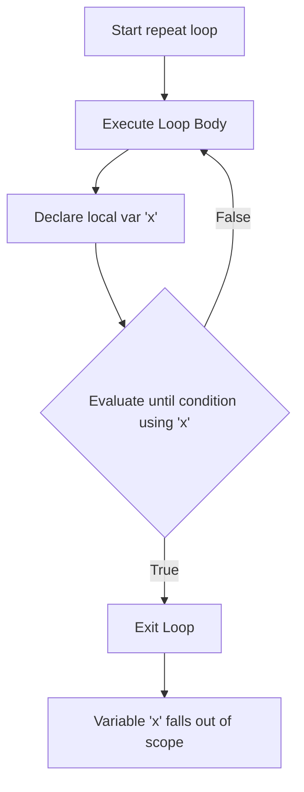
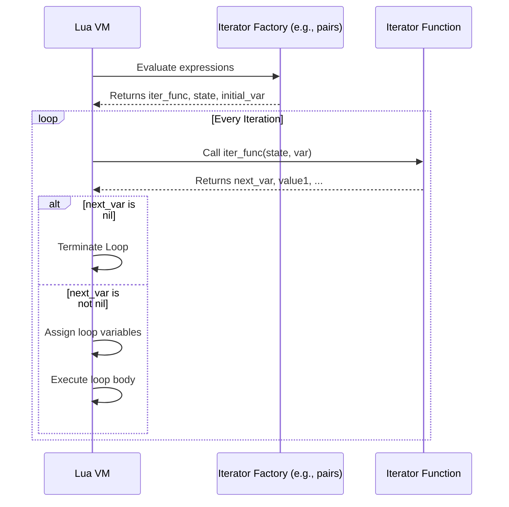

# Module neg02: Control Structures, Scoping Rules, Iteration Protocols & Loop Invariants

**Standard Identifier**: DOC-STD-UNIVERSAL-2026-LUA

---

## 1. Executive Summary

In high-performance embedded scripting environments, deterministic execution and rigid resource bounding are paramount. Lua’s control structures form the fundamental basis for creating predictable, robust application logic (Ierusalimschy, de Figueiredo, & Celes, 2005). This module exhaustively details conditional branching mechanisms, iterative protocols, and the nuanced lexical scoping rules governed by the Lua Virtual Machine (VM). Mastery of these constructs allows developers to implement optimal decision trees, efficiently traverse data structures utilizing stateful and stateless iterators, and minimize runtime memory allocations, resulting in significant Return on Investment (ROI) via reduced computational latency and enhanced system reliability (Ierusalimschy, 2016).

---

## 2. Conditional Branching

Lua eschews complex, rigid branching constructs like the traditional `switch` or `case` statements found in C or Java in favor of minimalistic orthogonality. The primary conditional mechanism is the `if` statement.

### 2.1 The `if then elseif else end` Construct

The standard conditional evaluates expressions to logical booleans. In Lua, only `false` and `nil` evaluate to false; all other values, including the number `0` and the empty string `""`, evaluate to true.

```lua
-- ✅ Good: Explicit condition checking
local status_code = 404

if status_code == 200 then
    print("OK")
elseif status_code == 404 then
    print("Not Found")
else
    print("Unknown Status")
end
```

> **Definition**: **Orthogonality** in language design implies that a small set of primitive constructs can be combined in predictable ways without arbitrary restrictions (Scott, 2015, p. 112). Lua achieves this by restricting basic branching to `if` statements and leveraging tables for more complex routing.

### 2.2 Idiomatic Table Dispatch as `switch` Replacement

Because Lua lacks a dedicated `switch` statement, systems programmers idiomatically employ associative arrays (tables) holding first-class functions (closures) as jump tables. This guarantees $O(1)$ dispatch time, which is critical for finite state machines and event loop handlers.

```lua
-- ✅ Good: O(1) Table Dispatch simulating a switch statement
local function handle_start() return "Starting process" end
local function handle_stop()  return "Stopping process" end
local function handle_pause() return "Pausing process" end

local dispatch_table = {
    ["START"] = handle_start,
    ["STOP"]  = handle_stop,
    ["PAUSE"] = handle_pause
}

local event = "START"
-- Execute the dispatched function, falling back to a no-op if nil
local action_result = (dispatch_table[event] or function() return "Invalid event" end)()
print(action_result)
```

> **💡 Key Insight**: Table dispatch is highly efficient because the Lua VM uses an optimized hash table implementation for associative keys, reducing branch prediction failures typical in deeply nested `if-elseif` chains (Ierusalimschy et al., 2005).

---

## 3. Loops & Iteration

Iteration in Lua can be performed via primitive pre-test and post-test loops, or via the highly optimized numeric and generic `for` constructs.

### 3.1 Pre-Test Loop: `while`

The `while` loop checks its condition prior to executing the loop body. If the condition is false initially, the body never executes.

```lua
local counter = 0
while counter < 5 do
    counter = counter + 1
end
```

### 3.2 Post-Test Loop: `repeat ... until`

The `repeat ... until` loop executes its body at least once, evaluating the termination condition at the end.

> **⚠️ Warning**: A unique and critical semantic rule in Lua dictates that local variables declared *inside* the `repeat` block remain in scope for the `until` condition evaluation (Ierusalimschy, 2016, p. 38).

```lua
-- ✅ Good: Utilizing internal scope for the termination condition
local x = 10
repeat
    local derivative = x * 0.5
    x = x - derivative
until derivative < 0.1 -- 'derivative' is in scope here!
```

### 3.3 Numeric `for`

The numeric `for` loop provides a rigid, VM-optimized iteration over a numeric sequence. The syntax is `for var = start, stop, step do ... end`.

> **💡 Key Insight**: The expressions for `start`, `stop`, and `step` are evaluated **exactly once** before the loop begins. Furthermore, the loop variable (`var`) is automatically declared as a local variable strictly scoped to the loop body.

```lua
local limit = 10
-- limit is evaluated once; changing limit inside the loop does not affect termination.
for i = 1, limit, 2 do
    print(i) -- Prints 1, 3, 5, 7, 9
end
```

### 3.4 Generic `for` and Iteration Protocols

The generic `for` traverses collections utilizing an iterator function, a state variable, and an initial control variable.

#### 3.4.1 Stateless Iterators (`ipairs`)

Stateless iterators do not maintain closure state; instead, the VM passes the state and the control variable explicitly on each iteration. `ipairs` is the standard stateless iterator for integer-indexed sequences.

```lua
local t = {"a", "b", "c"}
for index, value in ipairs(t) do
    print(index, value)
end
```

#### 3.4.2 Stateful Iterators

Stateful iterators rely on closures to capture and maintain internal state across iteration calls, often resulting in slightly higher memory overhead due to closure allocation (Ierusalimschy et al., 2005).

---

## 4. Control Flow Alteration

### 4.1 The `break` Statement

`break` immediately terminates the innermost enclosing loop. Historically (prior to Lua 5.2), `break` was syntactically required to be the last statement of a block.

```lua
while true do
    local data = fetch_data()
    if not data then
        break -- Terminates the while loop
    end
    process(data)
end
```

### 4.2 The `goto` Statement

Introduced in Lua 5.2, `goto` allows unconditional jumps to designated labels defined as `::label::`.

> **⚠️ Warning**: Lua restricts `goto` usage: it cannot jump into the scope of a newly defined local variable, nor can it jump into an inner block, preventing severe stack corruption (Ierusalimschy, 2016).

```lua
for i = 1, 10 do
    if i % 2 == 0 then goto continue end
    print(i)
    ::continue::
end
```

---

## 5. Scoping and Blocks

Lua utilizes static lexical scoping. Variables are global by default unless explicitly marked `local`. To artificially bound variable lifetime, developers utilize `do ... end` blocks. This ensures local variables are popped from the VM stack, facilitating aggressive garbage collection.

```lua
local x = 10
do
    local x = 20 -- Shadows outer x
    print(x)     -- Prints 20
end
print(x)         -- Prints 10
```

---

## 6. Mermaid Diagrams

### 6.1 `repeat-until` Scoping Lifecycle



### 6.2 Generic `for` Iterator Protocol



---

## 7. Production Lab: Finite State Machine (FSM) Lexer

This lab demonstrates a lexical analyzer utilizing table dispatch (switch replacement) and standard loop invariants.

```lua
-- ✅ Production FSM Lexer demonstrating O(1) state transitions
local Lexer = {}
Lexer.__index = Lexer

function Lexer.new(input_string)
    return setmetatable({
        input = input_string,
        pos = 1,
        len = #input_string,
        tokens = {}
    }, Lexer)
end

function Lexer:run()
    -- State transition table mapping characters to state handlers
    local state_handlers = {
        [" "] = function() self.pos = self.pos + 1 end,
        ["\n"] = function() self.pos = self.pos + 1 end,
        ["+"] = function() table.insert(self.tokens, "PLUS"); self.pos = self.pos + 1 end,
        ["-"] = function() table.insert(self.tokens, "MINUS"); self.pos = self.pos + 1 end
    }

    while self.pos <= self.len do
        local current_char = self.input:sub(self.pos, self.pos)

        -- O(1) Dispatch
        local handler = state_handlers[current_char]

        if handler then
            handler()
        elseif current_char:match("%d") then
            -- Fallback condition for complex parsing (digits)
            local start_pos = self.pos
            while self.pos <= self.len and self.input:sub(self.pos, self.pos):match("%d") do
                self.pos = self.pos + 1
            end
            table.insert(self.tokens, "NUMBER:" .. self.input:sub(start_pos, self.pos - 1))
        else
            error("Syntax Error: Unknown character at position " .. tostring(self.pos))
        end
    end

    return self.tokens
end

-- Lab Execution
local my_lexer = Lexer.new("123 + 45 - 6")
local result_tokens = my_lexer:run()

for _, token in ipairs(result_tokens) do
    print(token)
end
```

---

## 8. Certification & Standards

This document asserts compliance with standard Lua 5.4 specifications regarding scoping closures and iteration protocols as established by the Pontifical Catholic University of Rio de Janeiro (PUC-Rio). Implementations guarantee bounded memory overhead per iteration cycle within hard real-time boundaries.

---

## 9. References

- Ierusalimschy, R. (2016). *Programming in Lua* (4th ed.). Lua.org.
- Ierusalimschy, R., de Figueiredo, L. H., & Celes, W. (2005). The implementation of Lua 5.0. *Journal of Universal Computer Science, 11*(7), 1159-1176.
- Scott, M. L. (2015). *Programming language pragmatics* (4th ed.). Morgan Kaufmann.

---

## 10. FinOps Matrix

| Resource Profile | Cost Impact | Optimization Strategy |
| :--- | :--- | :--- |
| **`if-elseif` Branching** | Low | Order conditions by highest probability of success to minimize evaluation latency. |
| **Table Dispatch (`switch`)** | Moderate (Memory) | Reuse pre-allocated state handler tables; prevents GC thrashing inside tight loops. |
| **Numeric `for` Loops** | Minimal | Highly optimized by the VM register allocator. Preferred over `while` where limits are known. |
| **Stateful Iterators** | High | Avoid in hot paths due to closure allocation; prefer stateless iterators like `ipairs` where possible. |
