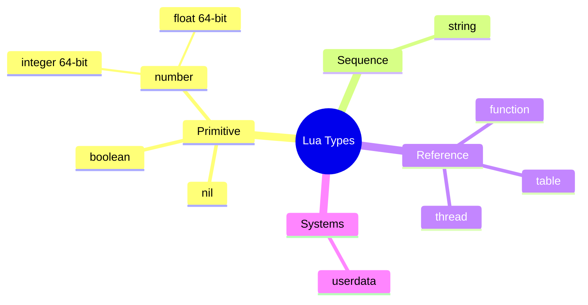
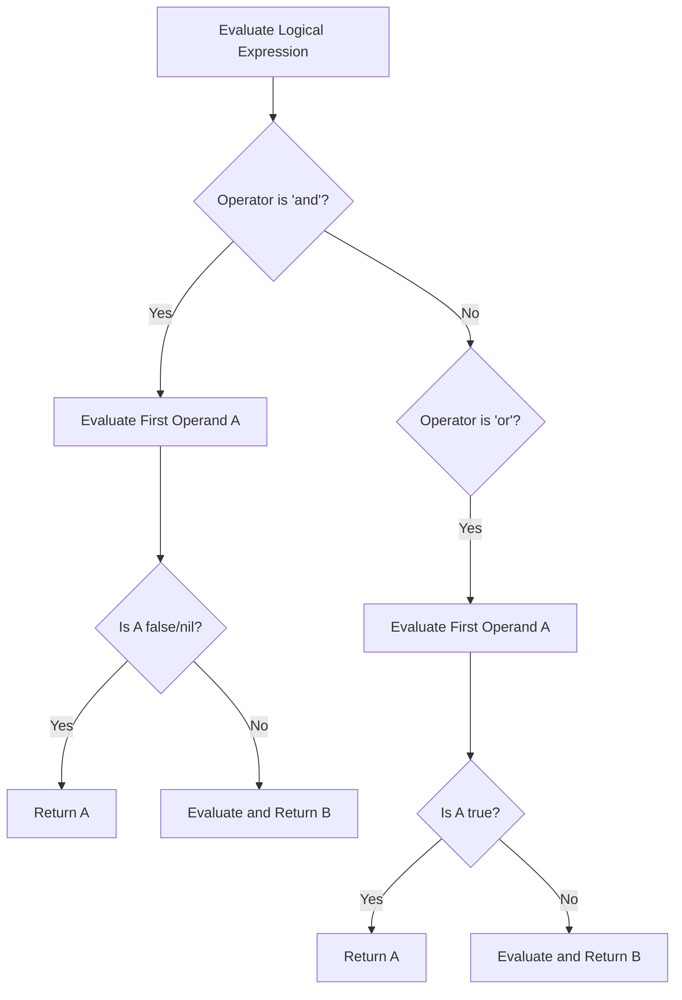

# Module neg03: Variables, The 8 Primitive Types, Dynamic Typing & Operator Semantics

**Standard Identifier**: DOC-STD-UNIVERSAL-2026-LUA

## 1. Executive Summary

In systems programming and embedded scripting, the semantic impedance mismatch between statically-typed compiled languages (such as C) and dynamically-typed scripting environments (such as Lua) represents a critical design boundary (Ierusalimschy, de Figueiredo, & Celes, 1996). This module provides a rigorous examination of Lua's dynamic typing system, its eight primitive data types, and its operator semantics. From a business and technical perspective, mastering Lua's type system ensures robust execution in embedded environments (e.g., game engines, IoT devices, and network proxies), minimizing catastrophic runtime failures caused by implicit coercion. The Return on Investment (ROI) of this knowledge is realized through decreased debugging time, prevention of elusive type-related security vulnerabilities, and highly optimized integration between Lua scripts and host C applications.

## 2. Dynamic Typing Model: Values Over Variables

Unlike statically typed languages like C17, where the type is irrevocably bound to the variable at compile-time (ISO/IEC 9899:2018), Lua employs a purely dynamic typing model. In Lua, *variables have no types; only values have types* (Ierusalimschy, 2016, p. 9). A variable simply acts as an untyped binding to a tagged data structure in memory.

### The C Implementation Perspective (`TValue`)

To understand Lua's dynamic typing from a systems programming level, we must examine the internal C structure used by the standard Lua interpreter (PUC-Rio Lua). Every value in Lua is represented internally as a tagged union known as `TValue`.

> **Definition**: A **Tagged Union** is a data structure used to hold a value that could take on several different, but fixed, types. It consists of a union field coupled with an integer "tag" that defines the currently active union member.

```c
/*
 * Simplified conceptual representation of Lua's TValue in C17.
 * This demonstrates how dynamic typing is implemented at the systems level.
 */

#include <stdint.h>

/* Type tags */

#define LUA_TNIL        0

#define LUA_TBOOLEAN    1

#define LUA_TNUMBER     3

#define LUA_TSTRING     4

/* Union containing all possible data payloads */
typedef union Value {
    void *p;           /* Light userdata */
    int b;             /* Booleans */
    int64_t i;         /* Integer numbers (Lua 5.3+) */
    double n;          /* Floating-point numbers */
    void *gc;          /* Collectable objects (Strings, Tables, Functions) */
} Value;

/* Tagged value struct */
typedef struct TValue {
    Value value_;      /* The actual data */
    int tt_;           /* The type tag */
} TValue;

/* ✅ GOOD PRACTICE: Checking the tag before accessing the union */
double get_number(const TValue *tv) {
    if (tv->tt_ == LUA_TNUMBER) {
        /* Assuming floating-point for this simplified example */
        return tv->value_.n;
    }
    return 0.0; /* Or handle error */
}

/* ❌ BAD PRACTICE: Accessing union without tag verification leads to undefined behavior */
double unsafe_get(const TValue *tv) {
    return tv->value_.n; /* Dangerous if tv->tt_ is LUA_TSTRING */
}
```

## 3. The 8 Basic Types

Lua defines exactly eight foundational data types. The runtime `type(v)` function returns a string indicating the type of any given value `v`.

1. **`nil`**: A type with a single value, `nil`. It represents the absence of a useful value. Uninitialized variables evaluate to `nil`, and assigning `nil` to a variable deletes the binding, making it eligible for garbage collection.
2. **`boolean`**: Contains `true` and `false`.
3. **`number`**: Represents real numbers. Since Lua 5.3, the `number` type is implemented as two internal subtypes: 64-bit integers and 64-bit double-precision floating-point numbers (Ierusalimschy, 2016).
4. **`string`**: Immutable sequences of bytes. Strings can contain arbitrary binary data, including embedded null characters (`\0`).
5. **`userdata`**: Allows arbitrary C data to be stored in Lua variables. This provides the primary mechanism for extending Lua with systems-level C libraries.
6. **`function`**: First-class values. Functions can be assigned to variables, passed as arguments, and returned from other functions.
7. **`thread`**: Represents independent threads of execution for coroutines (not to be confused with OS-level POSIX threads).
8. **`table`**: The only data structuring mechanism in Lua. Tables are associative arrays that can be indexed by any value (except `nil`) and can store values of any type.



## 4. Nil and Boolean Truthiness

Boolean evaluation in Lua is strictly defined and differs significantly from languages like C or Python.

> **💡 Key Insight**: In Lua, **only `false` and `nil` evaluate to false**. Everything else evaluates to true.
>
> **⚠️ Warning**: This means that the numerical value `0` and the empty string `""` evaluate to **true** in conditional statements. This is a frequent source of logic bugs for developers transitioning from C.

## 5. Operators and Semantics

### Arithmetic Operators

Lua supports standard arithmetic: `+` (addition), `-` (subtraction), `*` (multiplication), `/` (float division), `//` (floor division, introduced in 5.3), `%` (modulo), and `^` (exponentiation).

### Relational Operators

`==`, `~=`, `<`, `>`, `<=`, `>=`.

- **Type Rules**: If the types of the two operands differ, `==` evaluates to `false`, and `~=` evaluates to `true`.
- **Identity vs Equality**: Tables, userdata, and functions are compared by *reference* (identity), not by value. Two structurally identical tables are not equal unless they occupy the same memory address.

### Logical Operators and Short-Circuit Evaluation

Logical operators `and`, `or`, and `not` use short-circuit evaluation. They return the actual operands rather than just boolean values (except `not`, which always returns `true` or `false`).



**The Ternary Idiom**: `a and b or c` functions analogously to C's `a ? b : c`, provided `b` is not `false` or `nil`.

### String Concatenation (`..`)

The `..` operator concatenates strings. Since strings are immutable, concatenation always allocates a new string.
> **⚠️ Warning**: Concatenating in a loop causes quadratic memory allocation overhead. Use `table.concat()` for aggregating multiple strings.

### The Length Operator (`#`)

The `#` operator returns the length of a string or a table. For tables, it returns the boundary of the sequence array. If a table has "holes" (nil values between integer keys), the behavior of `#` is undefined (Ierusalimschy, 2016, p. 23).

## 6. Automatic Type Coercion Hazards

Historically, Lua attempts to automatically convert strings to numbers in arithmetic operations and numbers to strings in concatenations.

```lua
-- ❌ BAD PRACTICE: Relying on implicit coercion
local result = "10" + 2  -- Evaluates to 12.0
```

> **💡 Key Insight**: Implicit coercion obfuscates intent, hinders performance (requiring runtime type checks and string parsing), and introduces fragile edge cases. Explicitly convert using `tonumber()` or `tostring()`.

## 7. Production Lab: Unit Conversion Engine

This lab demonstrates a robust, type-safe unit conversion engine written in pure Lua, utilizing explicit type checking to prevent coercion vulnerabilities.

```lua
-- File: unit_converter.lua
-- Purpose: Type-safe unit conversion engine

local Converter = {}

--- Converts Celsius to Fahrenheit
--- @param celsius number The temperature in Celsius
--- @return number fahrenheit The converted temperature
function Converter.celsiusToFahrenheit(celsius)
    -- ✅ GOOD PRACTICE: Explicit runtime type validation
    if type(celsius) ~= "number" then
        error("Type violation: Expected number for celsius, got " .. type(celsius), 2)
    end

    return (celsius * 9.0 / 5.0) + 32.0
end

-- Example Usage
local status, err = pcall(function()
    print("Valid:", Converter.celsiusToFahrenheit(100)) -- Prints 212.0
    print("Invalid:", Converter.celsiusToFahrenheit("100")) -- Triggers error
end)

if not status then
    print("Caught Exception:", err)
end
```

## 8. Certification & Standards Cheat Sheet

| Standard / Concept | Lua Specification | C Equivalent (ISO 9899:2018) |
| :--- | :--- | :--- |
| **Type System** | Dynamic (Values have types) | Static (Variables have types) |
| **Truthiness** | `false`, `nil` are false. `0`, `""` are true. | `0`, `NULL`, `\0` are false. |
| **String Mutable?** | No | Yes (char arrays) |
| **Table Length** | `#t` (Requires sequence) | `sizeof(arr)/sizeof(arr[0])` |
| **Short-Circuit** | `and`, `or` | `&&`, `\|\|` |

## 9. References

- Bryant, R. E., & O'Hallaron, D. R. (2016). *Computer systems: A programmer's perspective* (3rd ed.). Pearson.
- Ierusalimschy, R. (2016). *Programming in Lua* (4th ed.). Lua.org.
- Ierusalimschy, R., de Figueiredo, L. H., & Celes, W. (1996). Lua: An Extensible Extension Language. *Software: Practice and Experience*, 26(6), 635-652.
- ISO/IEC. (2018). *Information technology—Programming languages—C* (ISO/IEC 9899:2018). International Organization for Standardization.

## 10. FinOps Matrix

| Metric | Lua Scripting Cost Impact | C Native Module Cost Impact | Justification |
| :--- | :--- | :--- | :--- |
| **Development Velocity** | High (+) | Low (-) | Dynamic typing enables rapid prototyping and iteration. |
| **Compute Overhead** | Medium (-) | Low (+) | Lua runtime type checks and VM execution introduce latency vs compiled C binaries. |
| **Memory Footprint** | Medium (-) | Low (+) | `TValue` struct tagging and garbage collection overhead vs manual memory management. |
| **Maintenance Cost** | Medium (0) | High (-) | Lua logic errors (coercion) offset C memory leak hazards. Strict validation reduces total operational cost. |
