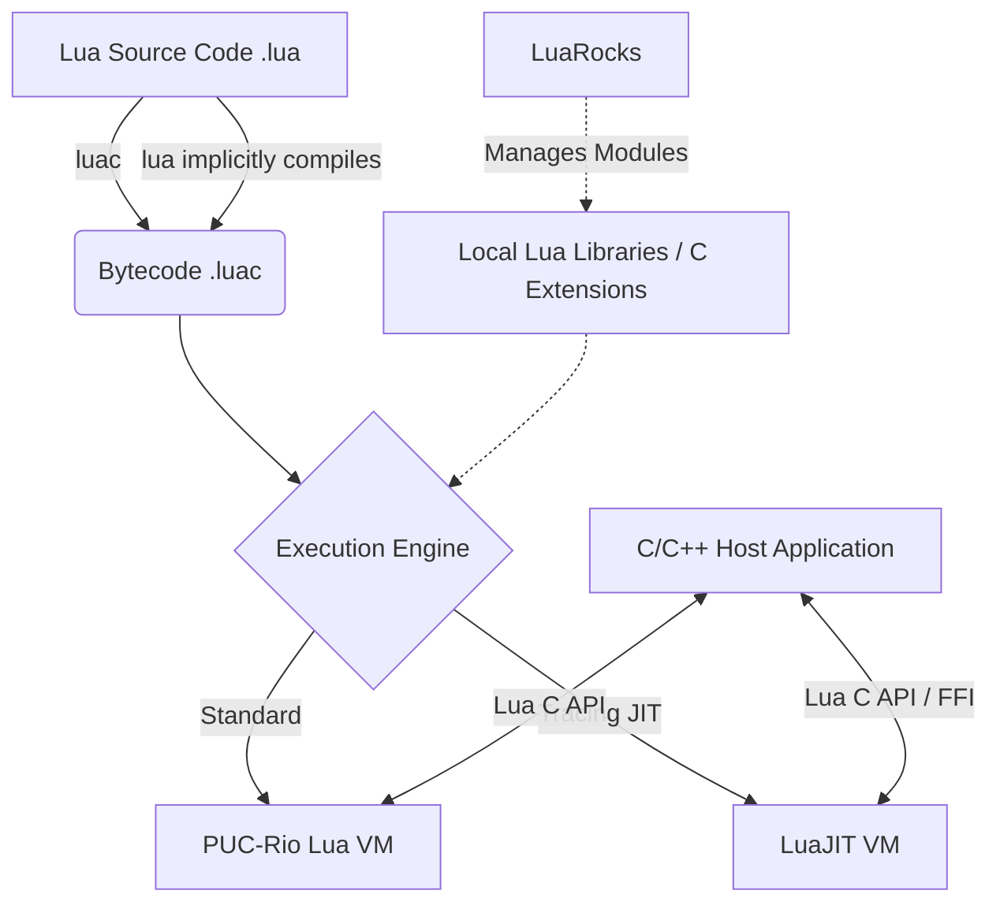
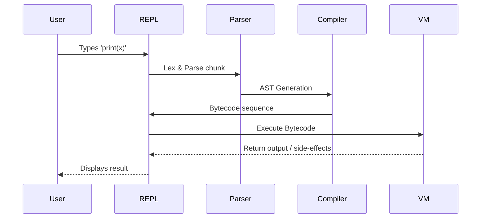

# Module neg04: Lua Environment Setup, Toolchain Ecosystem & First Lua Script

**Standard Identifier**: DOC-STD-UNIVERSAL-2026-LUA

## 1. Executive Summary

This module establishes the foundational knowledge required for professional Lua development, focusing on the toolchain ecosystem, environment configuration, and execution semantics. From a dual-audience perspective:

* **Business Purpose**: Lua's exceptional performance, minuscule memory footprint, and seamless C/C++ integration make it the premier scripting language for embedded systems, game engines, and high-throughput application extension. Properly configuring the Lua ecosystem accelerates time-to-market, ensures consistent developer environments, and mitigates technical debt associated with dependency management.
* **Technical Mechanics**: We dissect the compilation and execution pipeline of Lua scripts, examining the role of the PUC-Rio standalone interpreter (`lua`), the bytecode compiler (`luac`), and the Just-In-Time compiler (`LuaJIT`). We also cover robust environment setup utilizing LuaRocks and LSP-based editor configurations.
* **FinOps ROI**: Efficient Lua scripting inherently supports FinOps objectives. By pushing compute-intensive policy logic to lightweight Lua scripts embedded in edge proxies (e.g., Envoy, NGINX) or game servers, organizations drastically reduce cloud compute overhead. Lua's minimalistic design ensures high density per container, driving down infrastructure costs while maintaining microsecond-level latency.

## 2. What Lua IS: Historical Context and Design Philosophy

Lua was created in 1993 by Roberto Ierusalimschy, Waldemar Celes, and Luiz Henrique de Figueiredo at the Pontifical Catholic University of Rio de Janeiro (PUC-Rio) (Ierusalimschy et al., 1996). Born out of Brazil's strict trade barriers on computer hardware and software in the early 1990s, the developers needed a customizable, lightweight language that was highly portable and free from proprietary licensing constraints.

> **Definition**: **Mechanism over Policy**
> A design philosophy where a system provides the fundamental tools (mechanisms) to achieve a goal, rather than dictating a specific way (policy) to achieve it.

Lua epitomizes the "mechanism over policy" philosophy. Unlike Python or Ruby, which provide extensive standard libraries and rigid object-oriented frameworks, Lua offers a small set of highly flexible features. For instance, Lua provides *tables* as its sole data structuring mechanism, using them to implement arrays, dictionaries, sets, and object-oriented paradigms (classes, prototypes) via metatables (Ierusalimschy, 2016).

> **💡 Key Insight**: Lua was explicitly designed to be embedded within a host language (primarily C and C++). It is not just a language, but an ANSI C library. This architecture allows bidirectional communication: C code can invoke Lua functions, and Lua scripts can seamlessly execute optimized C routines (Ierusalimschy et al., 1996, p. 280).

## 3. The Toolchain: Ecosystem and Package Management

A professional Lua development environment extends beyond the core interpreter. The ecosystem comprises several critical components:

### 3.1. Implementation Variants

1. **PUC-Rio Lua (Standard Lua)**: The reference implementation written in pure ANSI C. It provides a standard interpreter and bytecode compiler. The current major versions are 5.1 (widely embedded), 5.3, and 5.4 (latest).
2. **LuaJIT**: A Just-In-Time (JIT) compiler developed by Mike Pall, primarily compatible with Lua 5.1 (with some 5.2/5.3 extensions). LuaJIT is renowned for being one of the fastest dynamic language implementations in existence, heavily utilizing trace compilation (Pall, 2015).

### 3.2. Installation Across Platforms

* **macOS**: Utilize Homebrew.

    ```bash
    brew install lua      # Installs the latest PUC-Rio Lua (e.g., 5.4)
    brew install luajit   # Installs LuaJIT 2.1
    brew install luarocks # Installs the package manager
    ```text

* **Linux (Ubuntu/Debian)**:

    ```bash
    sudo apt update
    sudo apt install lua5.4 liblua5.4-dev
    sudo apt install luajit
    sudo apt install luarocks
    ```text

* **Linux (Fedora)**:

    ```bash
    sudo dnf install lua lua-devel luajit luarocks
    ```text

* **Windows**: The recommended approach is using WSL (Windows Subsystem for Linux) and following the Linux instructions. Alternatively, use precompiled binaries from LuaBinaries or the MSYS2 toolchain.

### 3.3. LuaRocks Package Manager

LuaRocks is the standard package manager for Lua modules (rocks). It handles downloading, building, and installing Lua extensions, many of which involve compiling C code against the Lua C API.

> **⚠️ Warning**: When installing C-based LuaRocks on macOS or Linux, ensure you have the Lua development headers (`liblua-dev` or `lua-devel`) and a C compiler (GCC/Clang) installed in your system PATH.

## 4. Editor and IDE Configuration

Modern Lua development relies heavily on Language Server Protocols (LSP) to provide intelligent code completion, type checking, and linting.

### 4.1. Visual Studio Code Configuration

For VS Code, the industry standard is the **Lua Language Server** (often referred to as `sumneko.lua` or simply "Lua" by LuaLS in the extension marketplace).

**Configuration Steps:**

1. Install the "Lua" extension by sumneko.
2. Configure `.vscode/settings.json` for project-specific constraints:

    ```json
    {
      "Lua.runtime.version": "Lua 5.4",
      "Lua.diagnostics.globals": ["vim", "love"],
      "Lua.workspace.checkThirdParty": false
    }
    ```text

### 4.2. Linting with Luacheck

`luacheck` is a static analyzer for Lua. Install it via LuaRocks:

```bash
luarocks install luacheck
```

Create a `.luacheckrc` file in the project root to define strict linting rules:

```lua
-- .luacheckrc
std = "lua54"          -- Specify standard environment
max_line_length = 120  -- Enforce line length limits
globals = {"print"}    -- Allow specific globals, though avoiding them is preferred
ignore = {"212"}       -- Ignore specific warning codes (e.g., unused arguments)
```

## 5. Your First Script: Anatomy of execution

Let's dissect a robust initial script.

```lua

#!/usr/bin/env lua
-- hello.lua: A simple script demonstrating execution semantics

-- ✅ GOOD: Local variables provide faster access and avoid polluting the global scope.
local greeting = "Hello, production environment!"

local function display_message(msg)
    -- The print function outputs to standard output
    print(msg)
end

display_message(greeting)
```

### 5.1. Execution Semantics

1. **Shebang (`#!/usr/bin/env lua`)**: In UNIX-like systems, this allows the script to be executed directly from the shell (after `chmod +x hello.lua`), dynamically locating the `lua` executable via the `env` command.
2. **Compilation (`luac`)**: Lua scripts are not interpreted directly from source code. They are always compiled into bytecode first.

    ```bash
    # Explicitly compile to bytecode
    luac -o hello.luac hello.lua
    ```text

    Executing `luac` strips comments and translates human-readable code into VM instructions. The standard interpreter does this implicitly in memory when executing a `.lua` file.

3. **Chunk Execution**: In Lua terminology, a compiled unit of code is called a *chunk*. A chunk is essentially an anonymous function enclosing the entire script file.

## 6. The Lua Standalone Interpreter

The `lua` command-line executable serves dual purposes: it is an execution environment for scripts and an interactive read-eval-print loop (REPL).

### 6.1. Command-Line Arguments

When invoking the interpreter, several flags control its behavior:

* `-e stat`: Executes string `stat`. Useful for one-liners.

    ```bash
    lua -e "print(math.pi)"
    ```text

* `-l mod`: "Requires" the module `mod` before executing the script.

* `-i`: Enters interactive mode after executing the provided script.

    ```bash
    lua -i hello.lua
    ```text

* **The `arg` Table**: When a script is executed with arguments, Lua populates a global table named `arg`.

    ```bash
    lua script.lua foo bar
    # arg[1] == "foo", arg[2] == "bar"
    # arg[0] == "script.lua", arg[-1] == "lua"
    ```text

## 7. Architectural Diagrams

### 7.1. Lua Toolchain Architecture



### 7.2. REPL Execution Pipeline



## 8. Production Lab: Zero-Pollution Configuration Loader

A common embedded use-case is reading configuration files written in Lua. This lab demonstrates reading a configuration without polluting the global environment using `load()` and `setmetatable()`.

```lua
-- config_loader.lua

-- ✅ GOOD: Creating an isolated environment for execution
local function load_config(filename)
    -- 1. Read file contents
    local file, err = io.open(filename, "r")
    if not file then return nil, err end
    local content = file:read("*a")
    file:close()

    -- 2. Create a secure, isolated sandbox environment
    local sandbox = {}
    -- Allow access to standard math library securely, block os/io
    setmetatable(sandbox, { __index = { math = math } })

    -- 3. Load the chunk as a function, targeting the sandbox
    -- load (chunk, chunkname, mode, env)
    local chunk, load_err = load(content, filename, "t", sandbox)
    if not chunk then return nil, "Parse error: " .. load_err end

    -- 4. Execute the chunk
    local success, exec_err = pcall(chunk)
    if not success then return nil, "Execution error: " .. exec_err end

    return sandbox
end

-- Assume config.lua contains: host = "127.0.0.1"; port = 8080
-- local cfg = load_config("config.lua")
-- print(cfg.host) -- "127.0.0.1"
```

*Justification*: Using `load` with a strictly defined environment table (`sandbox`) prevents the configuration script from executing malicious code (like `os.execute("rm -rf /")`) or overwriting global application state (Ierusalimschy, 2016, p. 142).

## 9. Certification & Standards Cheat Sheet

| Standard / Tool | Description | Critical Flag / Practice |
| :--- | :--- | :--- |
| **ISO C Standard** | Lua is written in ANSI C (C89/C99). | Embeddability across all compliant C compilers. |
| **Lua Versioning** | Lua 5.1 vs 5.4 | Avoid syntax like `unpack` (5.1) use `table.unpack` (5.4). |
| **Luacheck** | Static analysis linter. | `--no-global` ensures all variables are declared `local`. |
| **Bytecode** | `luac` output format. | Bytecode is **architecture-dependent** (endianness/word size). |

## 10. Universal FinOps & Cloud Compute Governance

In modern cloud architectures, embedding Lua acts as a structural cost-optimization vector.

1. **Compute Density**: By migrating edge-routing logic from separate microservices (which require full OS containers, JVMs, or Node runtimes) into Lua scripts running directly within Envoy or NGINX memory spaces, organizations achieve exponential increases in request processing density per vCPU.
2. **Cold Start Eradication**: Serverless functions written in JVM/CLR languages suffer from cold starts. Lua VMs instantiate in microseconds, effectively eliminating cold start latency and the associated billed compute wait time.
3. **Governance Policy**: Enterprise FinOps mandates should classify high-frequency, low-complexity network path operations (e.g., rate-limiting, JWT validation) as "Edge-Native." These tasks must be implemented in Lua/WebAssembly rather than heavy mid-tier microservices to minimize unnecessary horizontal scaling triggers.

## 11. References

* Bryant, R. E., & O'Hallaron, D. R. (2016). *Computer Systems: A Programmer's Perspective* (3rd ed.). Pearson.
* Ierusalimschy, R., de Figueiredo, L. H., & Celes, W. (1996). Lua—an extensible extension language. *Software: Practice and Experience*, 26(6), 267-282.
* Ierusalimschy, R. (2016). *Programming in Lua* (4th ed.). Lua.org.
* Kernighan, B. W., & Ritchie, D. M. (1988). *The C Programming Language* (2nd ed.). Prentice Hall.
* Pall, M. (2015). *The LuaJIT Project*. LuaJIT.org. Retrieved from <https://luajit.org/>
* Patterson, D. A., & Hennessy, J. L. (2017). *Computer Organization and Design RISC-V Edition: The Hardware Software Interface*. Morgan Kaufmann.
* Stevens, W. R., Rago, S. A. (2013). *Advanced Programming in the UNIX Environment* (3rd ed.). Addison-Wesley Professional.
* Tanenbaum, A. S., & Bos, H. (2015). *Modern Operating Systems* (4th ed.). Pearson.
